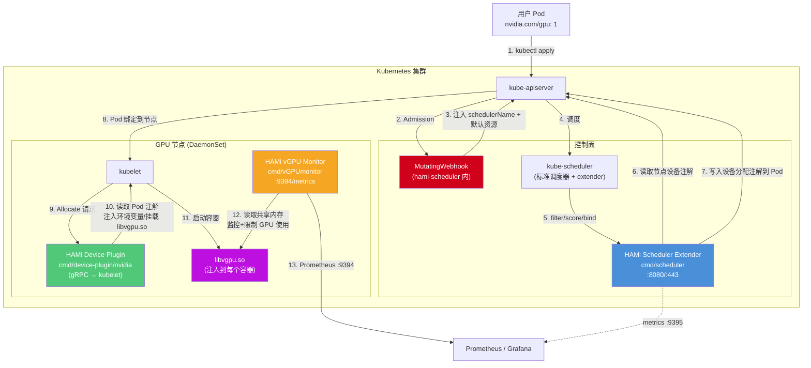
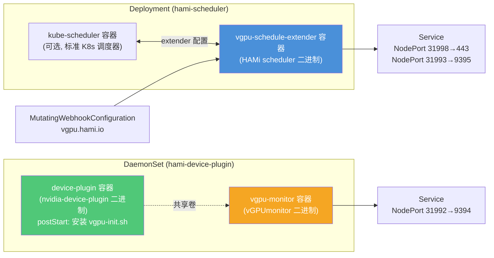
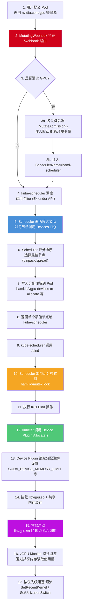
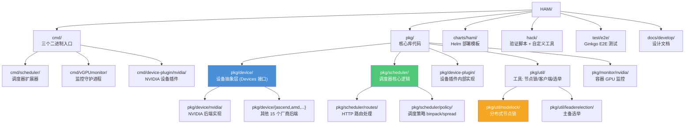
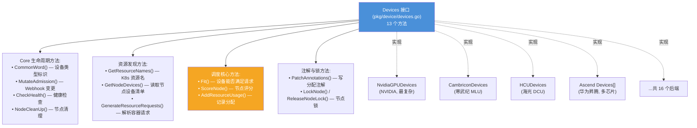
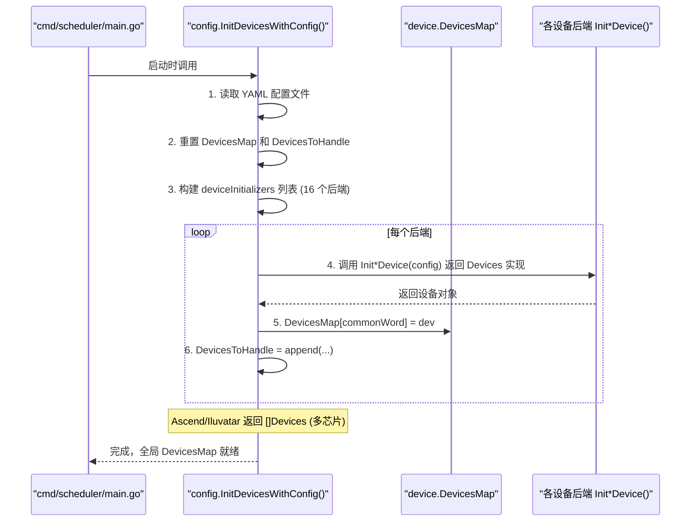
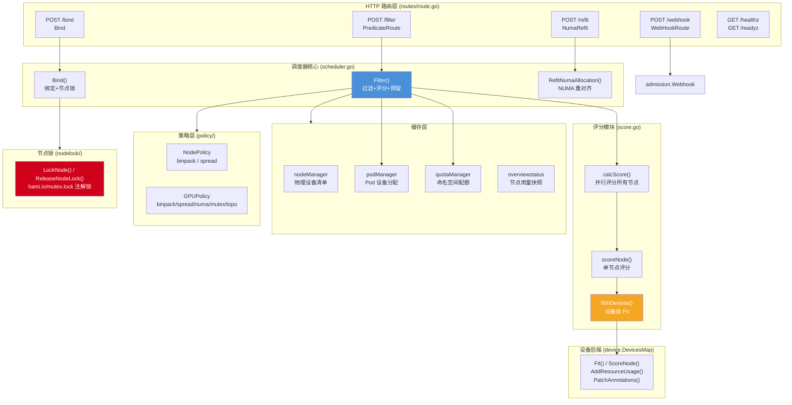
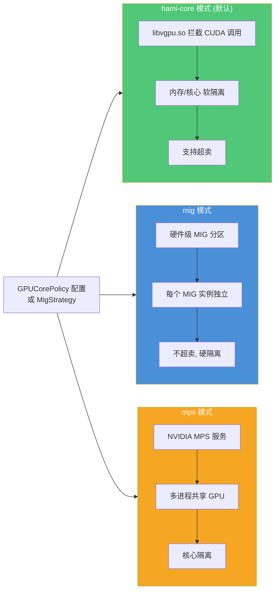
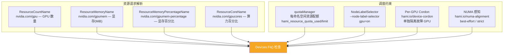

# 架构图

## 一、整体架构总览

HAMi 通过扩展 Kubernetes 调度器 + 设备插件 + 容器内拦截三层机制，实现 GPU/NPU 等加速器的虚拟化共享与隔离。

## 二、三大组件部署形态

HAMi 通过 Helm Chart（`charts/hami/`）部署，三个组件以不同方式运行：

| 组件 | 工作负载类型 | 主要容器 | 端口 | 副本 |
|------|------------|---------|------|------|
| Scheduler Extender | Deployment | kube-scheduler + vgpu-schedule-extender | 443/80 (调度), 9395 (metrics) | 1（可开主备选举） |
| Device Plugin | DaemonSet | device-plugin + vgpu-monitor | gRPC (kubelet socket), 9394 (metrics) | 每个GPU节点 1 个 |
| Webhook | 嵌入 Scheduler | — | 443 | 与 scheduler 同生命周期 |

## 三、核心数据流

下图展示了一个 Pod 从提交到运行的全生命周期中，各组件如何协作：

## 四、包目录结构

### 关键目录说明

| 目录 | 作用 | 入口文件 |
|------|------|---------|
| `cmd/scheduler/` | 调度器扩展器 HTTP 服务 | `main.go` (208行) |
| `cmd/vGPUmonitor/` | 每节点监控守护进程 | `main.go` (202行) |
| `cmd/device-plugin/nvidia/` | NVIDIA 设备插件 | `main.go` (599行) |
| `pkg/device/devices.go` | **Devices 接口定义**（13 个方法） | 核心抽象 |
| `pkg/device/nvidia/device.go` | NVIDIA 后端实现 | 最复杂的后端 |
| `pkg/scheduler/config/config.go` | **设备注册中心** `InitDevicesWithConfig()` | 注册 16 个后端 |
| `pkg/scheduler/scheduler.go` | 调度器核心：Filter/Bind/缓存 | 核心逻辑 |
| `pkg/scheduler/score.go` | 节点评分逻辑 | 两级评分 |
| `pkg/scheduler/routes/route.go` | HTTP 路由：/filter /bind /webhook | 路由入口 |
| `pkg/scheduler/policy/` | binpack/spread 策略 | 调度策略 |
| `pkg/util/nodelock/nodelock.go` | 注解式分布式锁 | 并发控制 |

## 五、设备抽象层架构

HAMi 的核心设计是**设备后端插件化**，所有硬件厂商实现统一的 `Devices` 接口：

### 设备注册流程

## 六、调度器内部架构

## 七、三种设备运行模式

HAMi 的 NVIDIA 后端支持三种设备隔离模式：

## 八、命名空间配额与节点选择

---

> **下一步阅读**：[02-核心调用链路.md](./02-核心调用链路.md) 了解每个流程的详细调用时序。
