# 核心调用链路

本文档用**时序图**详细描绘 HAMi 的几条核心调用链路。每条链路都标注了关键源码位置（`文件:行号`），方便对照阅读。

## 一、端到端总链路（Pod 从提交到运行）

这是 HAMi 最重要的一条链路，贯穿所有组件：

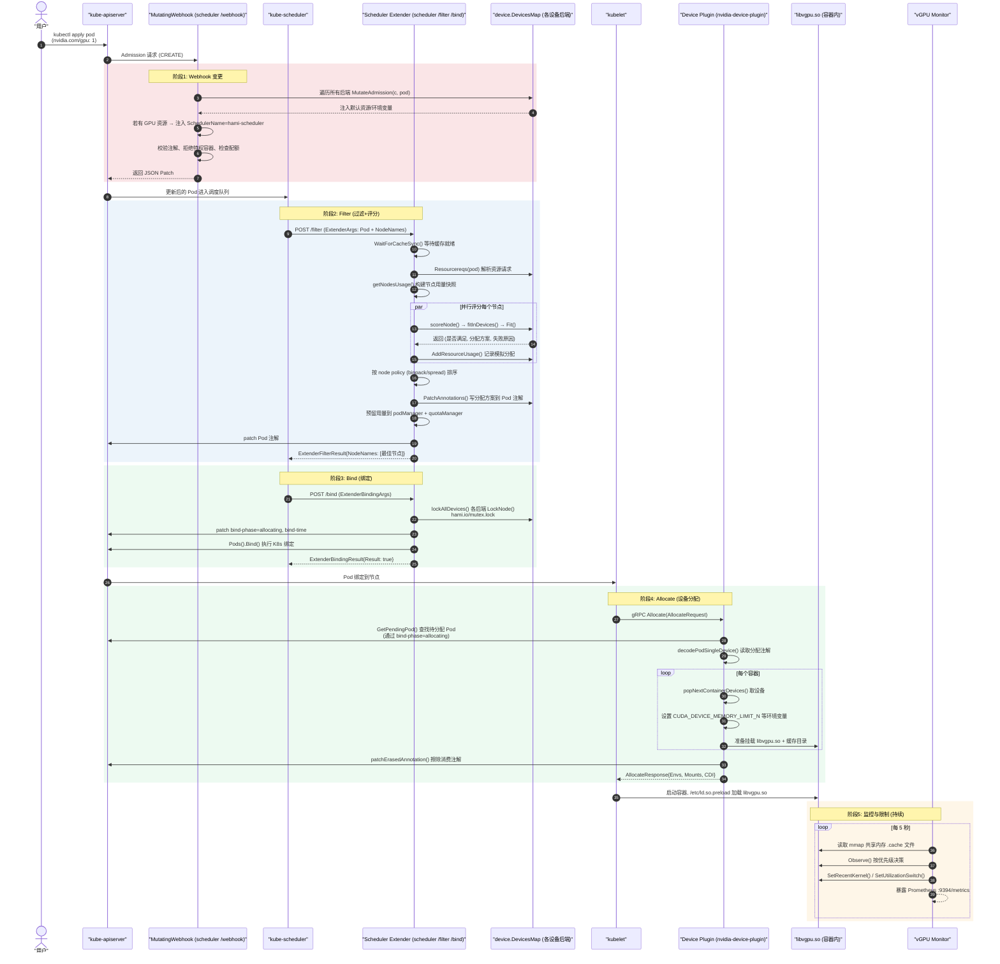

下面逐一展开各阶段的细节。

---

## 二、Webhook 链路（阶段 1 详解）

**入口**：`pkg/scheduler/routes/route.go:158` → `WebHookRoute()` → `pkg/scheduler/webhook.go:Handle()`

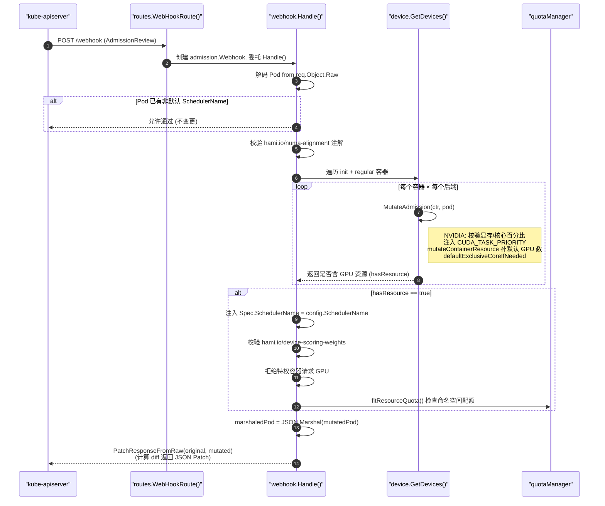

**关键源码**：
- `pkg/scheduler/webhook.go:54` — `Handle()` 主逻辑
- `pkg/device/nvidia/device.go:334` — `NvidiaGPUDevices.MutateAdmission()`
- `pkg/scheduler/webhook.go:161` — `fitResourceQuota()` 配额检查

---

## 三、Filter 链路（阶段 2 详解）

**入口**：`pkg/scheduler/routes/route.go:52` → `PredicateRoute()` → `pkg/scheduler/scheduler.go:1094` → `Filter()`

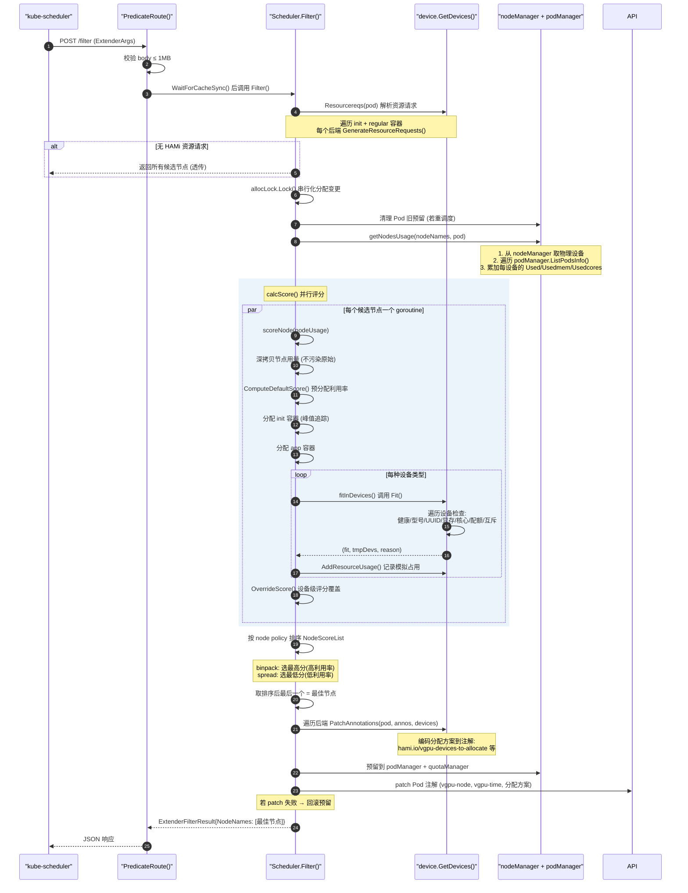

### Filter 内部的设备级 Fit 检查

`fitInDevices()`（`pkg/scheduler/score.go:86`）对每种设备调用后端的 `Fit()`，以 NVIDIA 为例（`pkg/device/nvidia/device.go:853`）：

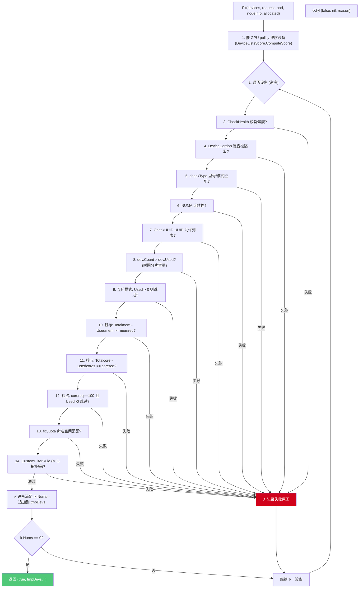

---

## 四、Bind 链路（阶段 3 详解）

**入口**：`pkg/scheduler/routes/route.go:114` → `Bind()` → `pkg/scheduler/scheduler.go:1025`

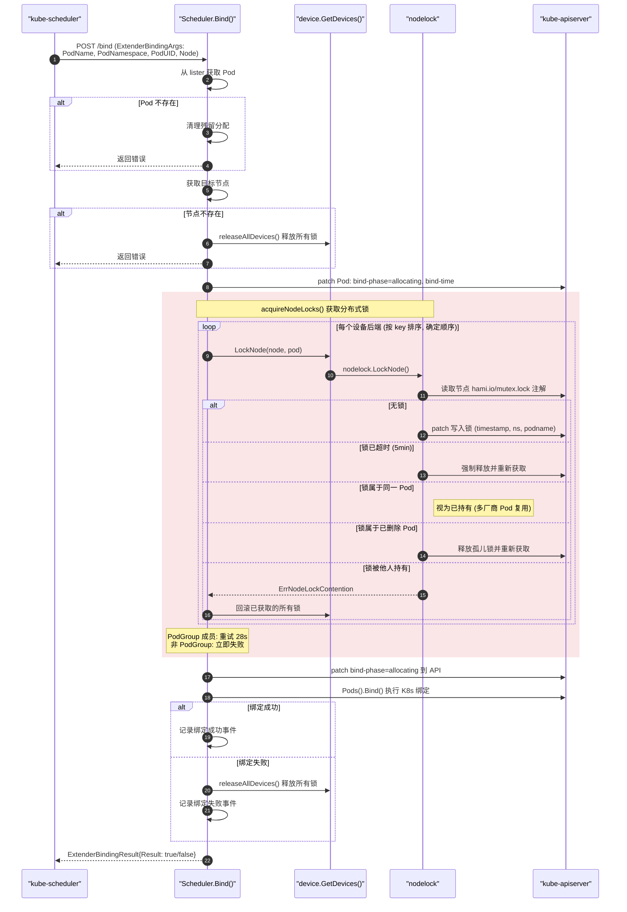

**关键源码**：
- `pkg/scheduler/scheduler.go:960` — `lockAllDevices()` 按排序遍历所有后端
- `pkg/scheduler/scheduler.go:999` — `acquireNodeLocks()` PodGroup 重试逻辑
- `pkg/util/nodelock/nodelock.go:255` — `LockNode()` 注解锁核心实现

---

## 五、Allocate 链路（阶段 4 详解）

**入口**：`pkg/device-plugin/nvidiadevice/nvinternal/plugin/server.go:852` → `Allocate()`

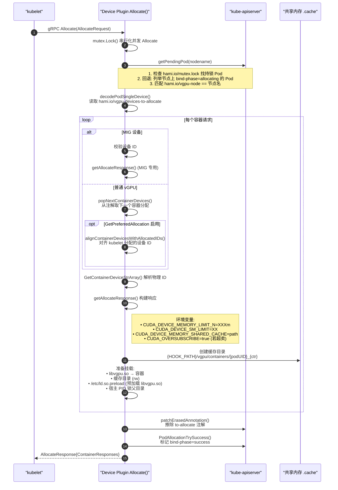

**关键源码**：
- `pkg/device-plugin/nvidiadevice/nvinternal/plugin/server.go:852` — `Allocate()` 主逻辑
- `pkg/util/util.go:76` — `GetPendingPod()` 查找待分配 Pod
- `pkg/device-plugin/nvidiadevice/nvinternal/plugin/server.go:942` — 环境变量注入

---

## 六、vGPU Monitor 监控链路（阶段 5 详解）

**入口**：`cmd/vGPUmonitor/main.go:106` → `watchAndFeedback()` → `cmd/vGPUmonitor/feedback.go:77` → `Observe()`

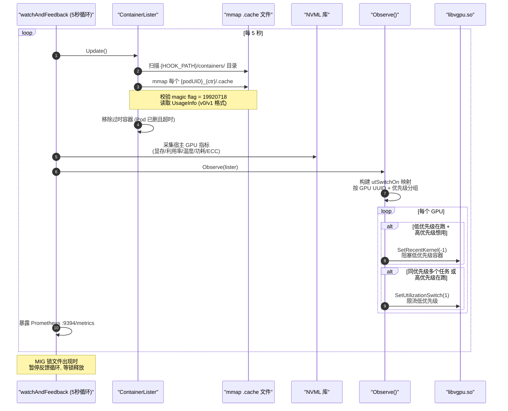

**关键源码**：
- `cmd/vGPUmonitor/feedback.go:77` — `Observe()` 优先级决策
- `pkg/monitor/nvidia/cudevshr.go:178` — `Update()` 容器列表刷新
- `cmd/vGPUmonitor/metrics.go:56` — Prometheus 指标定义

---

## 七、节点设备注册与缓存同步链路

**入口**：`cmd/scheduler/main.go:134` → `RegisterFromNodeAnnotations()`（`pkg/scheduler/scheduler.go:434`）

这是 scheduler 维护设备清单缓存的后台循环：

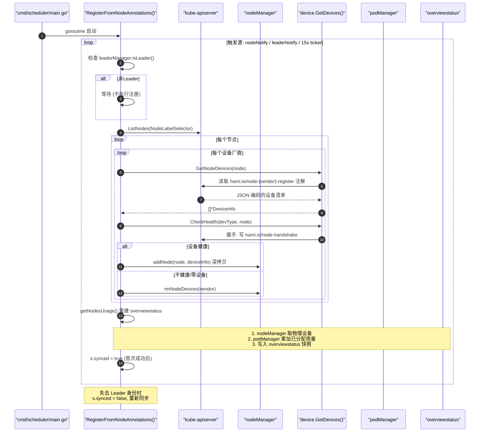

**关键源码**：
- `pkg/scheduler/scheduler.go:434` — `RegisterFromNodeAnnotations()` 主循环
- `pkg/scheduler/scheduler.go:644` — `WaitForCacheSync()` 阻塞直到首次同步
- `pkg/device/nvidia/device.go:289` — `GetNodeDevices()` 读取节点设备清单

---

## 八、两级评分链路

HAMi 采用**设备级评分 + 节点级评分**的两级评分体系：

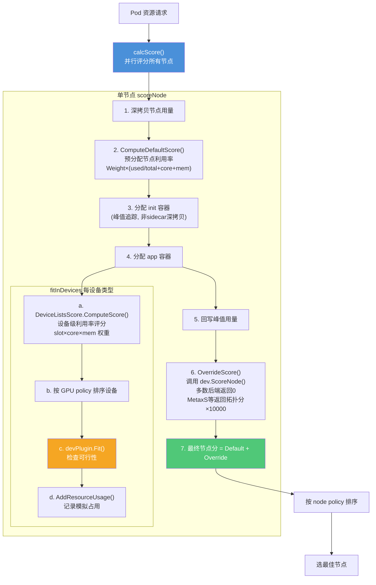

### 评分公式

**设备级评分**（`pkg/scheduler/policy/gpu_policy.go:200`）：
```
deviceScore = Weight × (slotWeight × (req+used)/count
                      + coreWeight × (reqCore+usedCore)/totalCore
                      + memWeight  × (reqMem+usedMem)/totalMem)
```

**节点级默认评分**（`pkg/scheduler/policy/node_policy.go:106`）：
```
nodeScore = Weight × (used/total + usedCore/totalCore + usedMem/totalMem)
```

**策略选择**：
- `binpack`：选分数最高（利用率最高）的节点 → 填满
- `spread`：选分数最低（利用率最低）的节点 → 分散

---

## 九、NUMA Refit 链路

当 kubelet 因 NUMA 拓扑选择了与 scheduler 不同的设备副本时，`/refit` 用于对齐：

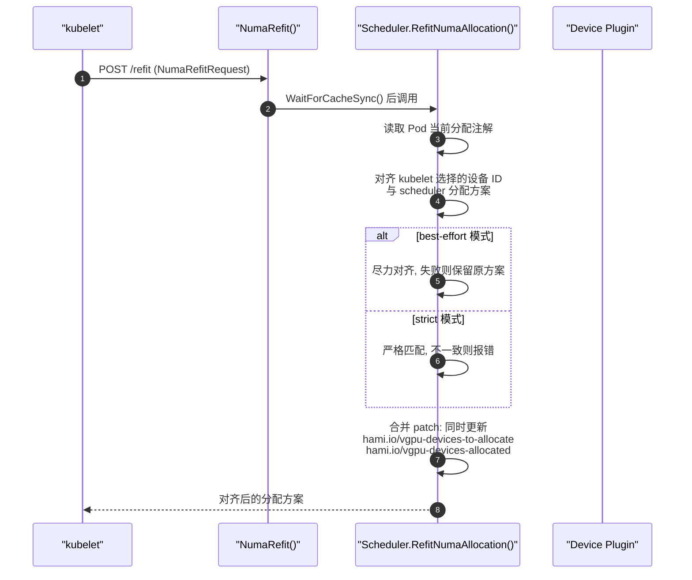

**关键源码**：`pkg/scheduler/numa_refit_handler.go`

---

## 十、MIG 动态分配链路

MIG 模式下，scheduler 与 device plugin 协作创建/销毁 MIG 实例：

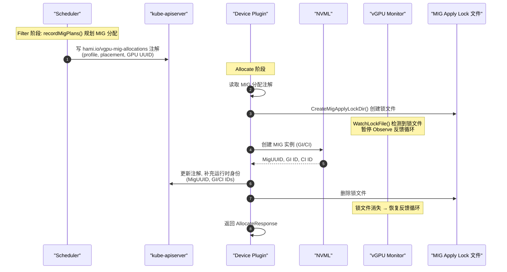

**关键源码**：
- `pkg/device/nvidia/mig_allocations.go` — MIG 分配注解编解码
- `pkg/device/nvidia/mig_topology.go` — MIG 拓扑冲突检测与联合规划
- `cmd/vGPUmonitor/main.go:90` — `WatchLockFile()` 协调

---

> **相关文档**：[03-组件功能及用途.md](./03-组件功能及用途.md) 了解每个组件的详细职责。
