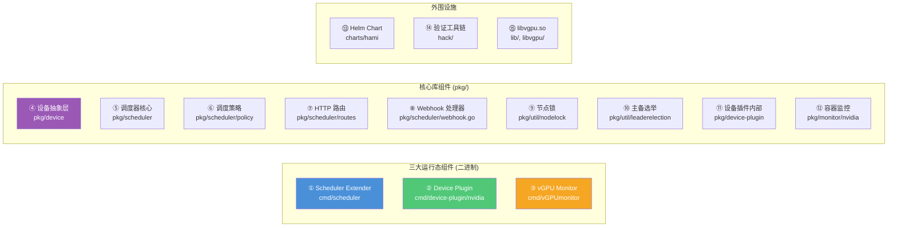
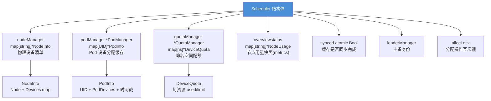
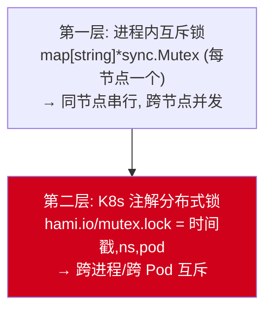
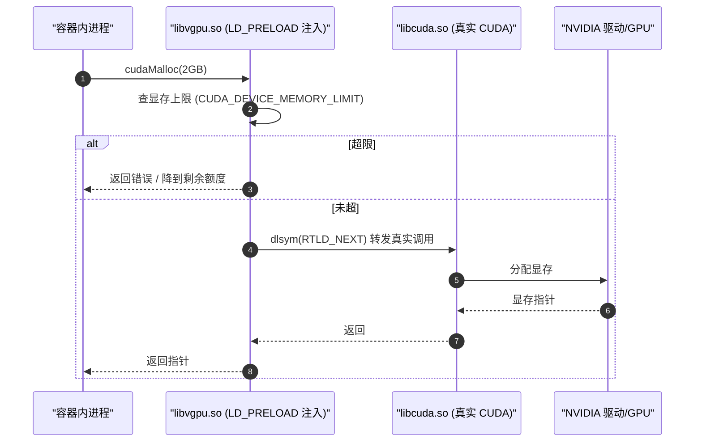

# 各个组件的功能及其用途

本文档逐一说明 HAMi 的每个组件：它是做什么的、解决什么问题、核心源码在哪里、关键配置是什么。

---

## 组件全景



---

## ① Scheduler Extender（调度器扩展器）

### 是什么
一个 HTTP 服务器，作为 kube-scheduler 的 **Extender** 运行，拦截 Pod 的调度决策（filter/score/bind），注入设备感知逻辑。

### 解决什么问题
标准 kube-scheduler 不理解 GPU 分片、显存隔离、MIG 分区等概念。它只能看到 `nvidia.com/gpu` 这种整数资源。HAMi Extender 让调度器理解"一张 GPU 可以分给多个 Pod，每个 Pod 用多少显存、多少算力"。

### 核心职责
| 职责 | 说明 | 源码 |
|------|------|------|
| 设备注册 | 启动时加载所有设备后端到 `DevicesMap` | `pkg/scheduler/config/config.go:99` `InitDevicesWithConfig()` |
| 节点设备清单缓存 | 后台读取节点注解，缓存每节点 GPU 清单 | `pkg/scheduler/scheduler.go:434` `RegisterFromNodeAnnotations()` |
| Pod 分配缓存 | 缓存每个 Pod 占用了哪些设备的多少资源 | `pkg/device/pods.go` `PodManager` |
| Filter 过滤 | 判断节点设备能否满足 Pod 需求 | `pkg/scheduler/scheduler.go:1094` `Filter()` |
| Score 评分 | 两级评分，选择最佳节点 | `pkg/scheduler/score.go:414` `calcScore()` |
| Bind 绑定 | 加节点锁、执行 K8s 绑定 | `pkg/scheduler/scheduler.go:1025` `Bind()` |
| Webhook 准入 | 变更 Pod（注入调度器名、默认资源） | `pkg/scheduler/webhook.go:54` `Handle()` |
| NUMA Refit | 对齐 kubelet NUMA 选择 | `pkg/scheduler/numa_refit_handler.go` |
| 指标暴露 | Prometheus :9395 | `cmd/scheduler/metrics.go` |

### 关键启动参数
| 参数 | 默认值 | 说明 |
|------|--------|------|
| `--http_bind` | `127.0.0.1:8080` | HTTP 监听地址 |
| `--scheduler-name` | — | 注入到 Pod 的 schedulerName |
| `--node-scheduler-policy` | `binpack` | 节点级调度策略 |
| `--gpu-scheduler-policy` | `spread` | GPU 级调度策略 |
| `--metrics-bind-address` | `:9395` | Prometheus 指标端口 |
| `--node-lock-timeout` | `5m` | 节点锁超时 |
| `--leader-elect` | `false` | 是否开启主备选举 |

### 部署形态
Deployment，通常 1 副本（可开 `leader-elect` 做主备）。两个容器：`kube-scheduler`（标准调度器，可选）+ `vgpu-schedule-extender`（HAMi）。

---

## ② Device Plugin（设备插件）

### 是什么
Kubernetes Device Plugin 的实现，基于 NVIDIA 官方 go-nvlib 改造。以 gRPC 方式与 kubelet 通信，向 kubelet 注册虚拟 GPU 资源。

### 解决什么问题
kubelet 需要知道节点上有多少"GPU 资源"才能分配。HAMi Device Plugin 把 1 张物理 GPU 切分成 N 份（`DeviceSplitCount`，默认 2），注册为 N 个虚拟设备，让 kubelet 以为节点有更多 GPU。

### 核心职责
| 职责 | 说明 | 源码 |
|------|------|------|
| GPU 发现 | 通过 NVML 枚举物理 GPU | `cmd/device-plugin/nvidia/main.go` `start()` |
| 资源注册 | gRPC `Register()` 向 kubelet 注册 vGPU 资源 | `pkg/device-plugin/.../plugin/server.go:583` |
| ListAndWatch | 上报设备列表与健康状态，处理 GPU 分片 | `pkg/device-plugin/.../plugin/server.go:621` |
| Allocate | 读取 Pod 注解，注入环境变量和挂载 | `pkg/device-plugin/.../plugin/server.go:852` |
| MIG 管理 | 创建/销毁 MIG 实例 | `pkg/device-plugin/.../plugin/server.go:290` |
| CDI 支持 | 生成容器设备接口规范 | `pkg/device-plugin/.../nvinternal/cdi/` |
| Hook 安装 | postStart 安装 libvgpu.so 到容器 | DaemonSet 的 postStart `vgpu-init.sh` |
| 配置热更新 | 监听 kubelet socket 变化，自动重启 | `cmd/device-plugin/nvidia/main.go:308` restart 循环 |

### Allocate 注入的关键环境变量
| 环境变量 | 说明 |
|---------|------|
| `CUDA_DEVICE_MEMORY_LIMIT_{i}` | 第 i 个设备的显存上限（如 `4096m`） |
| `CUDA_DEVICE_SM_LIMIT` | SM 核心限制（0-100） |
| `CUDA_DEVICE_MEMORY_SHARED_CACHE` | 共享内存缓存文件路径 |
| `CUDA_OVERSUBSCRIBE` | 显存超卖时设为 `true` |
| `GPU_CORE_UTILIZATION_POLICY` | 核心限制策略（`default`/`force`/`disable`） |

### 关键启动参数
| 参数 | 默认值 | 说明 |
|------|--------|------|
| `--device-split-count` | `2` | 每张 GPU 切分份数 |
| `--device-memory-scaling` | `1.0` | 显存缩放倍率（可>1超卖） |
| `--device-cores-scaling` | `1.0` | 算力缩放倍率 |
| `--mig-strategy` | `none` | MIG 策略：none/single/mixed |
| `--disable-core-limit` | `false` | 是否禁用核心限制 |

### 部署形态
DaemonSet，每个 GPU 节点 1 个 Pod。两个容器：`device-plugin` + `vgpu-monitor`。

---

## ③ vGPU Monitor（vGPU 监控守护进程）

### 是什么
每节点运行的监控守护进程，采集 GPU 使用指标并通过共享内存与容器内的 `libvgpu.so` 协作，执行资源限制和优先级调度。

### 解决什么问题
仅有资源分配不够，还需要**运行时执行**：防止容器超用显存、按优先级抢占 GPU 算力、暴露可观测指标。Monitor 充当反馈控制器。

### 核心职责
| 职责 | 说明 | 源码 |
|------|------|------|
| 容器列表维护 | 扫描共享内存，mmap `.cache` 文件 | `pkg/monitor/nvidia/cudevshr.go:178` `Update()` |
| 宿主 GPU 指标采集 | 通过 NVML 采集显存/利用率/温度/功耗/ECC | `cmd/vGPUmonitor/metrics.go` `ClusterManager` |
| 容器级指标采集 | 从共享内存读取每容器 vGPU 用量 | `cmd/vGPUmonitor/metrics.go:92` |
| 优先级调度 | 按优先级阻塞/限流低优先级容器 | `cmd/vGPUmonitor/feedback.go:77` `Observe()` |
| MIG 协调 | 通过锁文件暂停/恢复（避免 MIG 操作干扰监控） | `cmd/vGPUmonitor/main.go:90` `WatchLockFile()` |
| Prometheus 指标 | :9394/metrics | `cmd/vGPUmonitor/metrics.go` |

### 关键指标
| 指标 | 类型 | 说明 |
|------|------|------|
| `hami_host_gpu_memory_used_bytes` | Gauge | 宿主 GPU 显存使用 |
| `hami_host_gpu_utilization_ratio` | Gauge | 宿主 GPU 利用率 |
| `hami_vgpu_memory_used_bytes` | Gauge | 容器 vGPU 显存使用 |
| `hami_vgpu_memory_limit_bytes` | Gauge | 容器 vGPU 显存上限 |
| `hami_container_device_utilization_ratio` | Gauge | 容器 SM 利用率 |
| `hami_vgpu_memory_limit_bytes` | Gauge | 容器 vGPU 显存上限 |

### 工作原理
1. Device Plugin 在 Allocate 时为每个容器创建共享内存 `.cache` 文件
2. 容器内 `libvgpu.so` 写入实际 GPU 使用量到 `.cache`
3. Monitor 每 5 秒 mmap 读取所有 `.cache`
4. Monitor 按优先级决策，写回控制信号（`SetRecentKernel(-1)` 阻塞，`SetUtilizationSwitch(1)` 限流）
5. `libvgpu.so` 读取控制信号，决定是否放行 CUDA 调用

### 部署形态
DaemonSet 中的 `vgpu-monitor` 容器，与 Device Plugin 同 Pod。

---

## ④ 设备抽象层（Device Abstraction Layer）

### 是什么
定义统一的 `Devices` 接口（13 个方法），所有硬件厂商后端都实现此接口，实现插件化扩展。

### 解决什么问题
HAMi 支持 16 个厂商的加速器（NVIDIA/AMD/昇腾/海光/寒武纪等），每个厂商的资源模型不同。接口抽象让调度器逻辑与具体硬件解耦，新增厂商只需实现接口。

### `Devices` 接口（`pkg/device/devices.go:34`）

```go
type Devices interface {
    // 标识
    CommonWord() string                                    // 设备类型标识，如 "NVIDIA"

    // 准入
    MutateAdmission(ctr *corev1.Container, pod *corev1.Pod) (bool, error)  // Webhook 变更

    // 健康
    CheckHealth(devType string, n *corev1.Node) (bool, bool)               // 健康检查
    NodeCleanUp(nn string) error                                           // 节点清理

    // 资源发现
    GetResourceNames() ResourceNames                                       // K8s 资源名
    GetNodeDevices(n corev1.Node) ([]*DeviceInfo, error)                   // 读取节点设备清单
    GenerateResourceRequests(ctr *corev1.Container) ContainerDeviceRequest // 解析容器请求

    // 节点锁
    LockNode(n *corev1.Node, p *corev1.Pod) error
    ReleaseNodeLock(n *corev1.Node, p *corev1.Pod) error

    // 调度核心
    Fit(devices []*DeviceUsage, request ContainerDeviceRequest, pod *corev1.Pod, 
        nodeInfo *NodeInfo, allocated *PodDevices) (bool, map[string]ContainerDevices, string)
    ScoreNode(node *corev1.Node, podDevices PodSingleDevice, previous []*DeviceUsage, 
              policy string) float32
    AddResourceUsage(pod *corev1.Pod, n *DeviceUsage, ctr *ContainerDevice) error  // 记录分配

    // 注解
    PatchAnnotations(pod *corev1.Pod, annoinput *map[string]string, 
                     pd PodDevices) map[string]string                        // 写分配注解
}
```

### 支持的 16 个设备后端

| 后端 | CommonWord | 硬件 | 特点 |
|------|-----------|------|------|
| `nvidia/` | `NVIDIA` | NVIDIA GPU | 最复杂，支持 hami-core/mig/mps 三模式，NUMA，P2P 拓扑 |
| `amd/` | `AMD` | AMD GPU | 基本显存/核心 |
| `ascend/` | 多芯片 | 华为昇腾 NPU | 910A/B2/B3/B4/C, 310P3，支持 superpod |
| `cambricon/` | `MLU` | 寒武纪 MLU | MemoryFactor=256 |
| `hygon/` | `HCU` | 海光 DCU (原 DCU→HCU) | 可配 MemoryFactor |
| `iluvatar/` | 多芯片 | 天数智芯 GPU | MR-V100/V50/BI-V150/V100，多芯片配置 |
| `metax/` | `Metax-GPU`/`Metax-SGPU` | 摩尔线程 GPU | SGPU 支持拓扑感知 |
| `mthreads/` | `Mthreads` | 摩尔线程 GPU | MemoryFactor=512 |
| `enflame/` | `GCU`/`Enflame` | 启英 GCU | 整卡/分区两种 |
| `kunlun/` | `kunlun`/`XPU` | 百度昆仑 XPU | 整卡/虚拟两种 |
| `biren/` | `Biren` | 壁仞 GPU | 基本资源 |
| `vastai/` | `Vastai` | Vastai 加速器 | 基本资源 |
| `awsneuron/` | `AWSNeuron` | AWS Neuron | Inferentia/Trainium |

### 注册入口
`pkg/scheduler/config/config.go:99` — `InitDevicesWithConfig()` 遍历 16 个 `deviceInitializers`，调用每个后端的 `Init*Device()`，结果存入全局 `DevicesMap`。

---

## ⑤ 调度器核心（pkg/scheduler）

### 是什么
Scheduler Extender 的核心业务逻辑，包括缓存管理、节点过滤、评分、绑定。

### 核心数据结构


### 关键方法
| 方法 | 源码 | 说明 |
|------|------|------|
| `NewScheduler()` | `scheduler.go` | 创建调度器，初始化 informer |
| `Start()` | `scheduler.go` | 启动 informer，开始监听节点/Pod 变化 |
| `RegisterFromNodeAnnotations()` | `scheduler.go:434` | 后台循环同步节点设备缓存 |
| `Filter()` | `scheduler.go:1094` | filter 入口：解析请求→评分→选节点→写注解→预留 |
| `Bind()` | `scheduler.go:1025` | bind 入口：加锁→绑定→释放锁 |
| `RefitNumaAllocation()` | `numa_refit_handler.go` | NUMA 对齐 |
| `getNodesUsage()` | `scheduler.go` | 构建 NodeUsage 快照 |
| `WaitForCacheSync()` | `scheduler.go:644` | 阻塞直到首次同步完成 |

---

## ⑥ 调度策略（pkg/scheduler/policy）

### 是什么
实现节点级和设备级的调度策略，决定"选哪个节点"和"选哪张 GPU"。

### 节点级策略（`node_policy.go`）
| 策略 | 行为 | 适用场景 |
|------|------|---------|
| `binpack`（默认） | 选利用率最高的节点，填满 | 节省资源，减少碎片 |
| `spread` | 选利用率最低的节点，分散 | 负载均衡，容错 |

### GPU 级策略（`gpu_policy.go`）
| 策略 | 行为 | 适用场景 |
|------|------|---------|
| `spread`（默认） | 选最空闲的 GPU | 均衡 GPU 负载 |
| `binpack` | 选最忙的 GPU | 填满单卡 |
| `numa` | 按 NUMA 节点分组 | NUMA 亲和性 |
| `mutex` | 只用空闲 GPU（Used==0） | GPU 独占 |
| `topology-aware` | 按 P2P/NVLink 拓扑选最佳组合 | 多卡训练，优化互联 |

策略可链式组合，如 `binpack,numa`。

### 评分公式
- **设备级**（`gpu_policy.go:200`）：`score = W × (slot×(req+used)/count + core×(reqC+usedC)/totalC + mem×(reqM+usedM)/totalM)`
- **节点级**（`node_policy.go:106`）：`score = W × (used/total + usedCore/totalCore + usedMem/totalMem)`

---

## ⑦ HTTP 路由（pkg/scheduler/routes）

### 是什么
基于 `httprouter` 的 HTTP 路由层，将 Extender API 请求分发到调度器核心。

### 路由表
| 方法 | 路径 | Handler | 说明 |
|------|------|---------|------|
| POST | `/filter` | `PredicateRoute()` | 过滤+评分，返回单个最佳节点 |
| POST | `/bind` | `Bind()` | 绑定 Pod 到节点 |
| POST | `/refit` | `NumaRefit()` | NUMA 重对齐 |
| POST | `/webhook` | `WebHookRoute()` | 准入 Webhook |
| GET | `/healthz` | `HealthzRoute()` | 存活探针（恒 200） |
| GET | `/readyz` | `ReadyzRoute()` | 就绪探针（检查 Leader 状态） |

> **设计要点**：HAMi 没有 `/prioritize` 路由，而是将 filter 和 score 合并到 `/filter`，直接返回单个最佳节点，而非让 kube-scheduler 在多个候选中选择。

---

## ⑧ Webhook 处理器（pkg/scheduler/webhook.go）

### 是什么
基于 controller-runtime 的 `admission.Webhook`，处理 Pod 准入变更请求。

### 职责
1. **注入调度器名**：Pod 有 GPU 资源 → 设置 `SchedulerName=hami-scheduler`
2. **设备变更委托**：调用各后端 `MutateAdmission()`，注入默认资源/环境变量
3. **注解校验**：校验 `hami.io/numa-alignment`、`hami.io/device-scoring-weights`
4. **安全控制**：拒绝特权容器请求 GPU
5. **配额检查**：`fitResourceQuota()` 检查命名空间资源配额

---

## ⑨ 节点锁（pkg/util/nodelock）

### 是什么
基于 Kubernetes 节点注解 `hami.io/mutex.lock` 的分布式锁，防止多 Pod 并发分配同一节点的设备。

### 两层设计


### 锁值格式
`{RFC3339时间戳},{Pod命名空间},{Pod名称}`，如 `2024-01-15T10:30:00Z,default,my-pod`

### 超时与回收
- 默认 5 分钟超时（`--node-lock-timeout`，环境变量 `HAMI_NODELOCK_EXPIRE`）
- 超时后强制释放并重新获取
- 锁持有 Pod 已删除 → 自动回收孤儿锁
- 同一 Pod 多次获取 → 视为已持有（多厂商 Pod 复用）

---

## ⑩ 主备选举（pkg/util/leaderelection）

### 是什么
基于 Kubernetes `Lease` 对象的 Leader 选举，确保同一时刻只有一个 Scheduler 实例执行设备注册和绑定。

### 工作方式
- 监听指定名称的 Lease 对象
- `HolderIdentity` 以 hostname 开头即视为自己是 Leader
- 选举关闭时用 `DummyLeaderManager`（恒返回 true）

### 与调度的关系
- 非 Leader 时：不执行节点设备注册，`synced=false`，`/readyz` 可降级
- 失去 Leader 身份时：重置 `synced=false`，等待重新同步

---

## ⑪ 设备插件内部（pkg/device-plugin）

### 是什么
NVIDIA 设备插件的完整内部实现（fork 自 NVIDIA 官方 k8s-device-plugin 并改造）。

### 核心子模块
| 子模块 | 路径 | 职责 |
|--------|------|------|
| Plugin | `nvinternal/plugin/server.go` | gRPC 服务、Allocate、ListAndWatch |
| Resource Manager | `nvinternal/rm/` | 设备发现、MIG 管理 |
| CDI | `nvinternal/cdi/` | 容器设备接口规范 |
| Watcher | `nvinternal/watch/` | 文件/信号监听，自动重启 |
| Info | `nvinternal/info/` | 版本信息 |
| IMEX | `nvinternal/imex/` | IMEX 通道支持 |

---

## ⑫ 容器监控（pkg/monitor/nvidia）

### 是什么
vGPU Monitor 的核心库，通过共享内存读取容器内 GPU 使用量。

### 共享内存协议
- 路径：`{HOOK_PATH}/vgpu/containers/{podUID}_{containerName}/.cache`
- 结构：`headerT`（含 magic flag `19920718`）+ `UsageInfo`（v0/v1 两种格式）
- 访问方式：`mmap` 映射到进程内存

---

## ⑬ Helm Chart（charts/hami）

### 是什么
一键部署 HAMi 的 Helm Chart，包含所有 K8s 资源模板。

### 核心资源
| 组件 | 资源类型 | 模板文件 |
|------|---------|---------|
| Scheduler | Deployment + Service + MutatingWebhookConfiguration + RBAC + ConfigMap + PDB + cert-manager | `templates/scheduler/` |
| Device Plugin | DaemonSet + Service + RBAC + ConfigMap + ServiceMonitor + RuntimeClass | `templates/device-plugin/` |
| Webhook 初始化 | Job + RBAC（创建 TLS Secret，注入 CA 到 WebhookConfig） | `templates/scheduler/job-patch/` |

### values.yaml 核心配置
- `schedulerName: "hami-scheduler"`
- `devicePlugin.deviceSplitCount / deviceMemoryScaling / deviceCoreScaling`
- `devices.{ascend,iluvatar,mthreads,...}.enabled`
- 每厂商资源名定义（nvidia, mlu, hcu, metax 等）

---

## ⑭ 验证工具链（hack/）

### 是什么
CI 和本地验证脚本 + 自定义 Go 工具。

| 脚本 | 作用 |
|------|------|
| `verify-all.sh` | 总入口，串联所有检查 |
| `verify-staticcheck.sh` | golangci-lint v2.13.1（SHA 固定） |
| `verify-license.sh` | addlicense 检查 Apache 2.0 头 |
| `verify-import-aliases.sh` | 自定义 `preferredimports` 工具，强制 import 别名 |
| `verify-rbac.sh` | 自定义 `rbaccheck` 工具，AST 检查代码不越权 |
| `verify-chart-version.sh` | 检查 Chart.yaml 版本一致 |
| `unit-test.sh` | 单测（`--race -count=1 -covermode=atomic`） |
| `e2e-test.sh` | Ginkgo E2E |

---

## ⑮ libvgpu.so（容器内拦截库）

### 是什么
HAMi 的核心隔离库，注入到每个 GPU 容器中，通过 `LD_PRELOAD` 拦截 CUDA 调用。

### 工作原理
1. Device Plugin 在 Allocate 时挂载 `libvgpu.so` 到容器
2. 通过 `/etc/ld.so.preload` 自动加载
3. 拦截 `cudaMalloc` 等内存分配调用，执行显存上限检查
4. 拦截 CUDA 核心启动调用，执行算力限制
5. 通过共享内存 `.cache` 与 Monitor 双向通信

### 三种模式
| 模式 | 隔离方式 | 源码 |
|------|---------|------|
| `hami-core` | libvgpu.so 软隔离（内存+核心） | `lib/` |
| `mig` | 硬件 MIG 分区 | 依赖 NVML |
| `mps` | NVIDIA MPS 多进程服务 | 依赖 NVIDIA MPS daemon |

### LD_PRELOAD 机制详解

#### 一句话本质

`LD_PRELOAD` 是 Linux 动态链接器（`ld.so`）提供的一个机制：**在程序启动时、加载标准共享库之前，先加载你指定的 `.so` 文件**。由于动态符号解析是"先到先得"的，你的库里的函数会**抢先覆盖**后续库（如 `libc`、`libcuda`）里的同名函数，从而实现"拦截"。

#### 通用工作原理

程序调用 `malloc()`、`cudaMalloc()` 时，运行时按顺序查找符号定义：

1. `LD_PRELOAD` 指定的 `.so` —— 优先级最高，先到先得
2. 程序自身
3. `DT_NEEDED` 依赖库（`libc.so`、`libcuda.so` 等）
4. 报 `undefined symbol` 错

所以如果你写一个 `libmyhook.so`，里面定义一个 `malloc()`，用 `LD_PRELOAD=libmyhook.so ./your_program` 运行，程序里所有 `malloc` 调用都会先进入你的版本。你可以在里面打印日志、改参数、再调用真正的 `malloc`（通过 `dlsym(RTLD_NEXT, "malloc")` 拿到原始函数）。

```c
// libmyhook.c 示例
void* malloc(size_t size) {
    // 拦截：记录/限制/改写
    void* (*real_malloc)(size_t) = dlsym(RTLD_NEXT, "malloc");
    void* p = real_malloc(size);
    fprintf(stderr, "malloc(%zu) = %p\n", size, p);
    return p;
}
// 编译: gcc -shared -fPIC -o libmyhook.so libmyhook.c -ldl
// 运行: LD_PRELOAD=./libmyhook.so ./your_program
```

#### HAMi 为什么需要它

HAMi 的核心目标：一张物理 GPU 分给多个 Pod，每个 Pod 限制只能用 N MiB 显存、M% 算力。但 NVIDIA 驱动和 CUDA 库本身**不支持**这种软隔离——`cudaMalloc` 只看 GPU 总显存。

HAMi 的解法就是用 `LD_PRELOAD` 把自研的 `libvgpu.so` 注入到每个 GPU 容器里，拦截所有 CUDA API 调用，在调用真正执行前做配额检查：



#### HAMi 具体怎么注入的

从代码看（`pkg/device-plugin/.../plugin/server.go` 的 `Allocate()`），Device Plugin 在容器启动时做两件事：

| 步骤 | 作用 |
|------|------|
| 挂载 `libvgpu.so` 到容器 | 让容器内能找到这个库文件 |
| 写入 `/etc/ld.so.preload` | 告诉动态链接器：每个进程启动时都预加载 libvgpu.so |

关键点：HAMi 用的是 **`/etc/ld.so.preload`**（系统级配置文件），而不是 `LD_PRELOAD` 环境变量。区别：

- `LD_PRELOAD`（环境变量）—— 只对设置了该变量的进程生效，需要逐个设置
- `/etc/ld.so.preload`（文件）—— 对该容器内**所有**进程自动生效，包括用户程序 fork 出的子进程

```
# 容器内 /etc/ld.so.preload 内容大致是:
/usr/local/vgpu/libvgpu.so
```

这样容器里任何进程一启动，`libvgpu.so` 就自动加载，所有 CUDA 调用都被拦截，无需修改用户代码——这就是 HAMi "零应用改动"承诺的技术基础。

#### HAMi 拦截了哪些调用

`libvgpu.so` 主要拦截这几类：

| 拦截目标 | 实现的隔离 |
|---------|-----------|
| `cudaMalloc` / `cuMemAlloc` 等内存分配 | **显存隔离**：按 `CUDA_DEVICE_MEMORY_LIMIT_N` 限制每容器显存 |
| CUDA kernel 启动（`cuLaunchKernel` 等） | **算力隔离**：按 `CUDA_DEVICE_SM_LIMIT` 限制 SM 使用比例 |
| `cudaGetDeviceProperties` 等 | 向应用"撒谎"：报告缩水后的显存/算力，避免框架按全卡分配 |
| 设备枚举 | 控制 `nvidia-smi` 等看到的设备视图 |

同时 `libvgpu.so` 通过**共享内存 `.cache` 文件**与节点上的 vGPU Monitor 双向通信：把实际用量写进去给 Monitor 看，读 Monitor 写回的控制信号（阻塞/限流）。

#### 局限性

- **只能拦动态链接的调用**：静态链接的 CUDA 程序绕过 `LD_PRELOAD`，HAMi 对此无效（这也是为什么要求 NVIDIA 作为默认 runtime、CUDA 动态链接）
- **可被绕过**：恶意容器清空 `/etc/ld.so.preload` 或用静态二进制就能逃逸——HAMi 的隔离是**软隔离**，面向"可信用户共享"，不是安全边界
- **`CUDA_DISABLE_CONTROL=true` 时跳过**：HAMi 支持对特定容器关闭拦截（用真实 GPU 直通）

> 简单说：`LD_PRELOAD` / `/etc/ld.so.preload` 是 HAMi 实现"一张 GPU 给多个 Pod 用、各用各的额度"的关键技术支点，`libvgpu.so` 才是真正干活的隔离逻辑。

---

> **相关文档**：[04-组件调用关系.md](./04-组件调用关系.md) 了解这些组件如何通过接口和注解协作。
