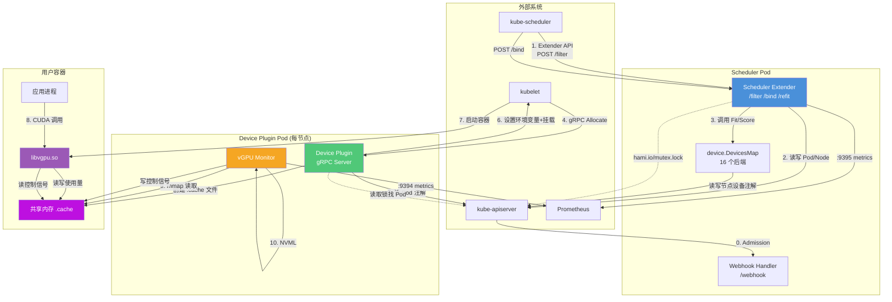
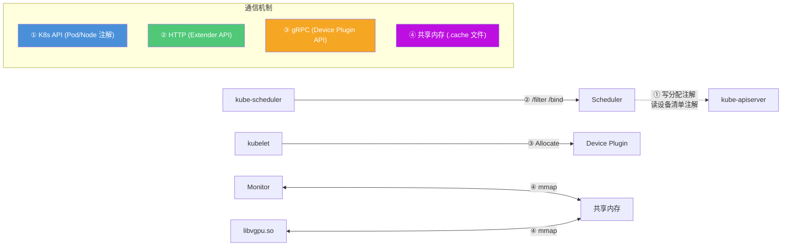
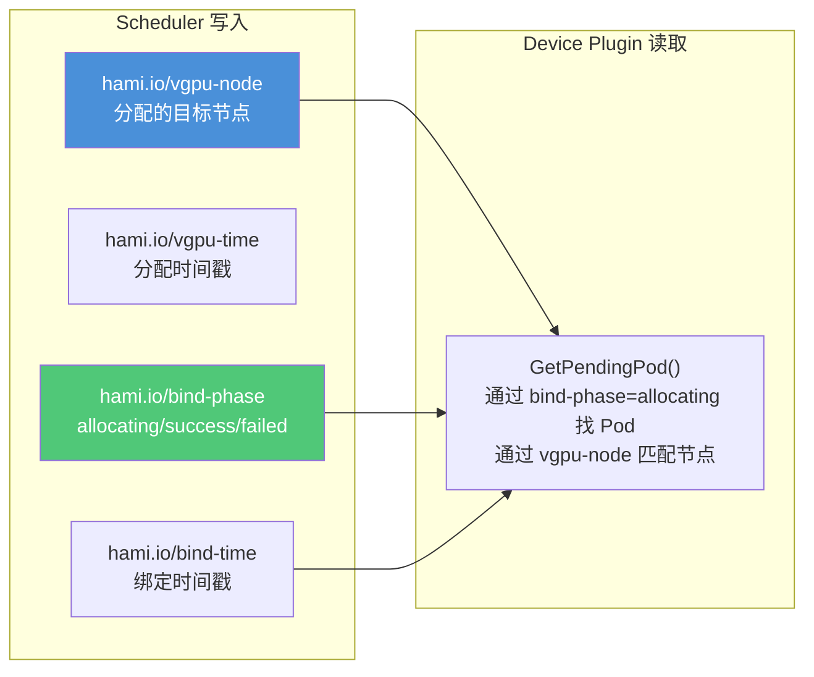
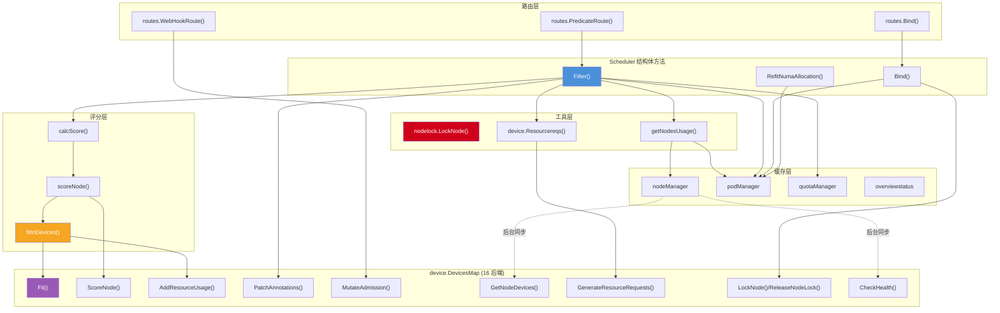
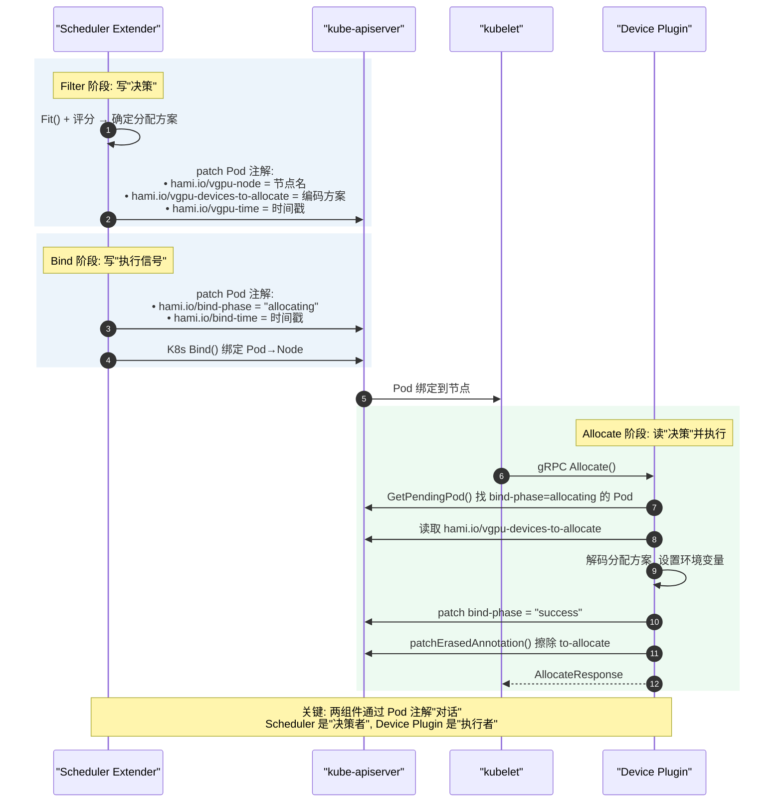
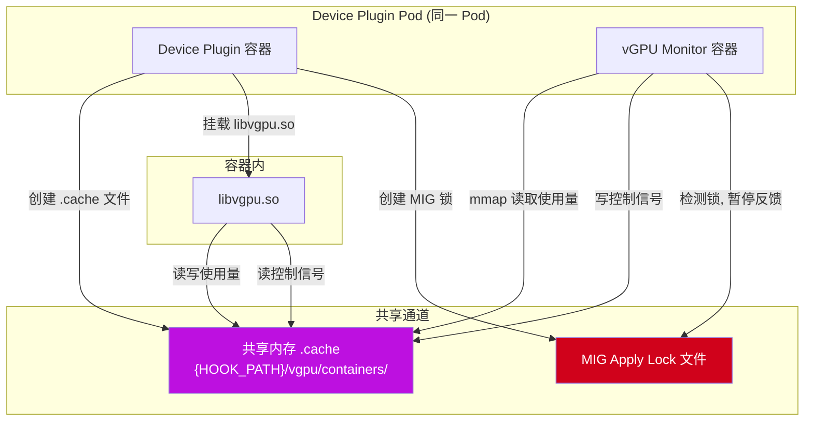
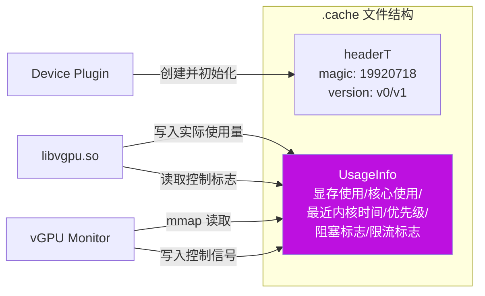
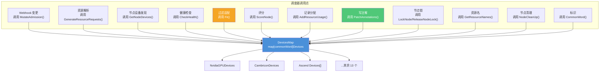
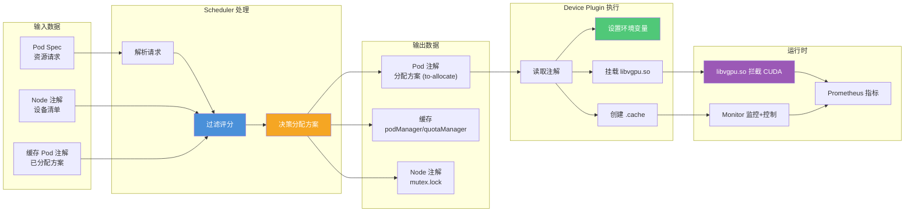
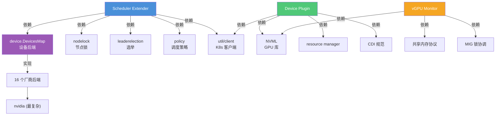

# 组件之间的调用关系

本文档说明 HAMi 各组件之间的调用关系、接口边界和数据流向。理解组件如何协作，是深入 HAMi 的关键。

## 一、组件交互总览



## 二、接口边界与通信协议

HAMi 各组件之间通过 **4 种通信机制**协作：



| 通信机制 | 使用方 | 方向 | 载体 |
|---------|--------|------|------|
| ① K8s 注解 | Scheduler ↔ API Server ↔ Device Plugin | 双向 | Pod/Node annotations (`hami.io/`) |
| ② HTTP Extender API | kube-scheduler → Scheduler Extender | 请求-响应 | JSON over HTTP (ExtenderArgs) |
| ③ gRPC Device Plugin API | kubelet → Device Plugin | 请求-响应 | gRPC (ListAndWatch, Allocate) |
| ④ 共享内存 | libvgpu.so ↔ vGPU Monitor | 双向 | mmap 的 `.cache` 文件 |

---

## 三、注解契约——组件间的"API"

**注解是 HAMi 组件协作的核心契约**。Scheduler 写入，Device Plugin 读取，Monitor 间接依赖。下面是完整的注解体系。

### 3.1 Pod 生命周期注解



### 3.2 设备分配注解（核心契约）

这是 Scheduler 和 Device Plugin 之间最重要的数据传递通道。每个设备后端有 **to-allocate**（调度器写入，待执行）和 **allocated**（已确认分配）两个注解：

| 厂商 | to-allocate（调度器→插件） | allocated（确认） |
|------|---------------------------|-------------------|
| NVIDIA | `hami.io/vgpu-devices-to-allocate` | `hami.io/vgpu-devices-allocated` |
| AMD | `hami.io/amd-devices-to-allocate` | `hami.io/amd-devices-allocated` |
| 寒武纪 | `hami.io/cambricon-mlu-devices-to-allocate` | `hami.io/cambricon-mlu-devices-allocated` |
| 海光 | `hami.io/hcu-devices-to-allocate` | `hami.io/hcu-devices-allocated` |
| 昆仑 | `hami.io/xpu-devices-to-allocate` | `hami.io/xpu-devices-allocated` |
| 摩尔线程 | `hami.io/mthreads-vgpu-devices-to-allocate` | `hami.io/mthreads-vgpu-devices-allocated` |
| 启英 | `hami.io/enflame-gcu-devices-to-allocate` | `hami.io/enflame-gcu-devices-allocated` |

分配注解的编码格式（以 NVIDIA 为例）：
```
GPU_ID,类型,已用显存,已用核心,UUID;GPU_ID,类型,...
```

### 3.3 节点设备注册注解（Device Plugin → Scheduler）

Device Plugin 定期上报节点设备清单，Scheduler 读取并缓存：

| 注解 | 写入方 | 读取方 | 内容 |
|------|--------|--------|------|
| `hami.io/node-nvidia-register` | Device Plugin | Scheduler `GetNodeDevices()` | JSON 编码的 GPU 清单（ID/显存/核心/型号/MIG） |
| `hami.io/node-handshake` | Device Plugin | Scheduler `CheckHealth()` | 握手心跳，证明插件存活 |
| `hami.io/node-nvidia-score` | Device Plugin | Scheduler | GPU 间 P2P/NVLink 拓扑评分 |

其他厂商模式类似：`hami.io/node-{vendor}-register`、`hami.io/node-handshake-{vendor}`。

### 3.4 节点锁注解

| 注解 | 写入方 | 读取方 | 值格式 |
|------|--------|--------|--------|
| `hami.io/mutex.lock` | Scheduler `LockNode()` | Scheduler `LockNode()` | `RFC3339时间戳,ns,pod` |

### 3.5 调度策略注解（用户 → Scheduler）

| 注解 | 作用 | 可选值 |
|------|------|--------|
| `hami.io/node-scheduler-policy` | 覆盖节点策略 | `binpack` / `spread` |
| `hami.io/gpu-scheduler-policy` | 覆盖 GPU 策略 | `binpack`/`spread`/`numa`/`mutex`/`topology-aware`，可逗号组合 |
| `hami.io/device-scoring-weights` | 自定义评分权重 | `slot=1,core=1,memory=3` |
| `hami.io/numa-alignment` | NUMA 对齐模式 | `best-effort` / `strict` |
| `hami.io/device-cordon` | 隔离指定 GPU | 逗号分隔的 GPU UUID 列表 |

### 3.6 MIG 专用注解

| 注解 | 作用 |
|------|------|
| `hami.io/vgpu-mig-allocations` | JSON 编码的 MIG 分配详情（profile/placement/GI/CI ID） |

---

## 四、Scheduler 内部调用关系



### 调用链路文字描述

| 触发点 | 调用链 |
|--------|--------|
| Webhook | `WebHookRoute()` → `webhook.Handle()` → 各后端 `MutateAdmission()` → `fitResourceQuota()` |
| Filter | `PredicateRoute()` → `Filter()` → `Resourcereqs()`→`GenerateResourceRequests()` → `getNodesUsage()`→`nodeManager`+`podManager` → `calcScore()`→`scoreNode()`→`fitInDevices()`→`Fit()`+`AddResourceUsage()` → `PatchAnnotations()` → 写入 `podManager`+`quotaManager` |
| Bind | `Bind()` → `lockAllDevices()`→各后端`LockNode()`→`nodelock.LockNode()` → `kubeClient.Bind()` |
| 缓存同步 | `RegisterFromNodeAnnotations()` → `GetNodeDevices()`→`CheckHealth()`→`nodeManager.addNode()` |

---

## 五、Scheduler 与 Device Plugin 的协作

两个组件**不直接通信**，而是通过 kube-apiserver 上的 Pod 注解间接协作：



### 数据流总结

```
Scheduler 决策:
  hami.io/vgpu-node          → 告诉 DP "这个 Pod 归我管, 分到这个节点"
  hami.io/vgpu-devices-to-allocate → 告诉 DP "用这些 GPU, 每个用多少显存/核心"
  hami.io/bind-phase=allocating    → 告诉 DP "现在可以执行分配了"

Device Plugin 执行:
  读取 to-allocate 注解      → 知道该挂载哪些 GPU
  设置 CUDA_DEVICE_MEMORY_LIMIT → 通知 libvgpu.so 限制显存
  创建 .cache 文件           → 建立与 Monitor 的共享内存通道
  写 bind-phase=success      → 通知 Scheduler "分配完成"
```

---

## 六、Device Plugin 与 vGPU Monitor 的协作

两个组件运行在**同一个 DaemonSet Pod**中，通过共享卷和共享内存协作：



### 共享内存协议



---

## 七、设备后端接口调用关系

所有 16 个设备后端实现相同的 `Devices` 接口，调度器通过 `DevicesMap` 统一调用：



### 各后端实现的差异点

| 后端 | Fit() 复杂度 | ScoreNode() | 特殊能力 |
|------|-------------|-------------|---------|
| NVIDIA | 最高（~170行） | 返回 0（评分在 Fit 内做） | MIG 规划、P2P 拓扑、NUMA、配额、cordon |
| Metax SGPU | 中 | 返回拓扑分（`policyNeutralScorer`） | 拓扑感知 |
| Ascend | 中 | 返回 0 | 多芯片、superpod、模板配额 |
| AMD/寒武纪/海光等 | 低 | 返回 0 | 基本显存/核心隔离 |

> **设计要点**：`ScoreNode()` 默认返回 0，多数后端不实现自定义评分，评分逻辑统一在 `policy` 层。只有需要特殊拓扑评分的后端（如 Metax SGPU）才实现 `policyNeutralScorer` 接口，其评分通过 `OverrideScore()` 以 ×10000 权重叠加。

---

## 八、数据流总图



---

## 九、关键依赖关系（谁依赖谁）



### 依赖说明
- **Scheduler** 依赖设备后端（调度决策）、节点锁（并发控制）、选举（高可用）、策略（评分）
- **Device Plugin** 依赖 NVML（GPU 发现）、CDI（容器规范）、K8s 客户端（读注解）
- **vGPU Monitor** 依赖 NVML（宿主指标）、共享内存（容器指标）、MIG 锁文件（协调）
- **三者共同依赖** `libvgpu.so`（运行时隔离）和 `pkg/util/client`（K8s 客户端）

---

> **相关文档**：[05-学习路线.md](./05-学习路线.md) 规划如何系统地学习这些组件。
