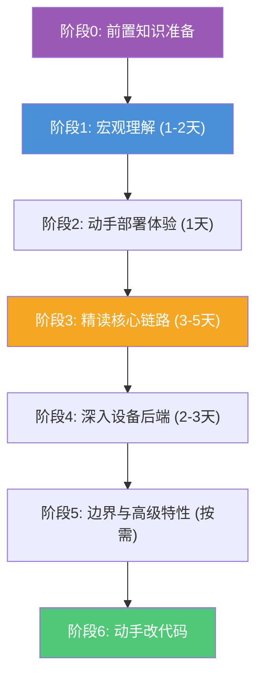
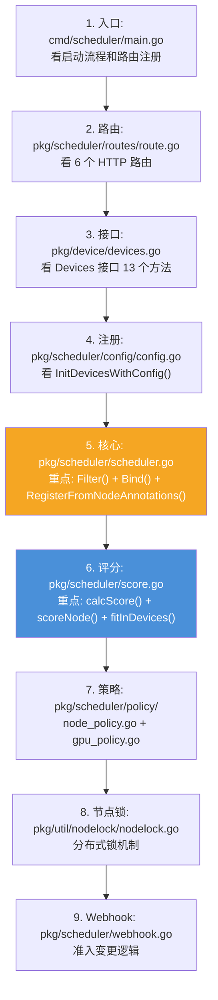
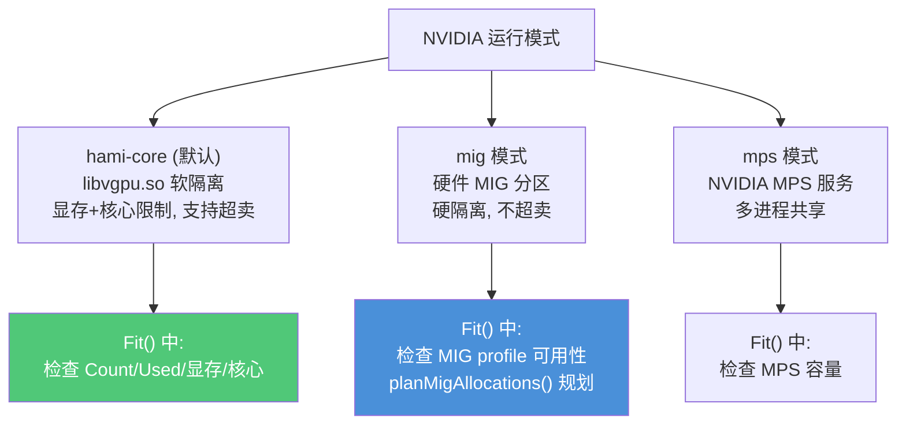
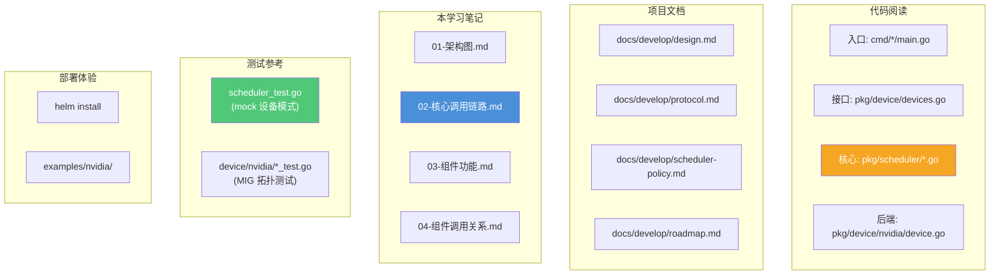

# 从哪里入手学习

本文档为初学者规划一条从浅到深的学习路线。HAMi 涉及 Kubernetes 调度、设备插件、GPU 虚拟化等多个领域，建议按阶段循序渐进。

## 学习路线总览



---

## 阶段 0：前置知识准备

在深入 HAMi 之前，确保你具备以下基础：

### 必备知识

| 领域 | 需要掌握的程度 | 学习资源 |
|------|--------------|---------|
| **Go 语言** | 能读懂 struct/interface/goroutine/channel，理解 context | [A Tour of Go](https://go.dev/tour/) |
| **Kubernetes 基础** | 理解 Pod/Node/Deployment/DaemonSet/Service，知道 Controller/Informer 机制 | [K8s 官方文档](https://kubernetes.io/docs/) |
| **K8s 调度器** | 理解 kube-scheduler 的 filter/score/bind 流程，知道 Extender 机制 | [Scheduler 文档](https://kubernetes.io/docs/concepts/scheduling-eviction/) |
| **K8s Device Plugin** | 理解 device plugin 的 ListAndWatch/Allocate gRPC 接口 | [Device Plugin 文档](https://kubernetes.io/docs/concepts/extend-kubernetes/compute-storage-net/device-plugins/) |
| **GPU/CUDA 基础** | 理解 GPU 显存、SM（流多处理器）、MIG 分区的概念 | NVIDIA 文档 |
| **Linux 容器** | 理解 `LD_PRELOAD`、`/etc/ld.so.preload`、cgroups、共享内存 | — |

### 选读（非必须，但有助于深入）
- Kubernetes MutatingWebhook / ValidatingWebhook 机制
- controller-runtime 库
- NVML（NVIDIA Management Library）
- cgroups v1/v2 资源限制

---

## 阶段 1：宏观理解（1-2 天）

**目标**：建立全局认知，知道 HAMi 是什么、由什么组成、解决什么问题。

### 阅读顺序

1. **README.md** — 了解项目定位、支持设备、快速开始
2. **docs/develop/design.md** — 高层架构设计（含流程图）
3. **docs/develop/roadmap.md** — 支持矩阵、路线图
4. **docs/develop/scheduler-policy.md** — 调度策略评分公式
5. **docs/develop/protocol.md** — 设备注册协议、注解格式
6. **CLAUDE.md** — 项目概览、构建命令、架构说明

### 配合本文档

- 读 [01-架构图.md](./01-架构图.md) 建立视觉认知
- 读 [03-组件功能及用途.md](./03-组件功能及用途.md) 了解每个组件职责

### 关键问题自测

阅读后，你应该能回答：
- [ ] HAMi 的三个二进制组件分别是什么？各自部署形态？
- [ ] 一张物理 GPU 如何分给多个 Pod？靠什么机制隔离？
- [ ] Scheduler Extender 和标准 kube-scheduler 是什么关系？
- [ ] HAMi 支持哪些调度策略？
- [ ] Pod 注解在组件协作中扮演什么角色？

---

## 阶段 2：动手部署体验（1 天）

**目标**：在真实环境跑起来，感性认识各组件。

### 前置条件
- 一个有 NVIDIA GPU 的 K8s 集群（或用 [kind](https://kind.sigs.k8s.io/) + mock 模式体验调度逻辑）
- NVIDIA 驱动 ≥ 440，nvidia-docker ≥ 2.0

### 步骤

```bash
# 1. 给 GPU 节点打标签
kubectl label nodes <node-name> gpu=on

# 2. 安装 HAMi
helm repo add hami-charts https://project-hami.github.io/HAMi/
helm install hami hami-charts/hami -n kube-system

# 3. 观察 Pod
kubectl get pods -n kube-system | grep hami
# 应看到: hami-scheduler-xxx (Deployment), hami-device-plugin-xxx (DaemonSet)

# 4. 提交一个使用 GPU 的 Pod
kubectl apply -f examples/nvidia/default_use.yaml

# 5. 查看 Pod 注解，理解组件协作
kubectl get pod <pod-name> -o yaml | grep "hami.io/"
# 应看到: vgpu-node, vgpu-time, vgpu-devices-to-allocate, bind-phase 等

# 6. 查看节点设备注解
kubectl get node <node-name> -o yaml | grep "hami.io/"
# 应看到: node-nvidia-register, node-handshake, mutex.lock

# 7. 查看 Prometheus 指标
kubectl port-forward -n kube-system svc/hami-vgpu-device-plugin 9394:9394 &
curl localhost:9394/metrics | grep hami_
```

### 体验调度策略

```bash
# 使用 spread 策略
kubectl annotate pod <pod-name> hami.io/node-scheduler-policy=spread
kubectl annotate pod <pod-name> hami.io/gpu-scheduler-policy=topology-aware
```

---

## 阶段 3：精读核心链路（3-5 天）

**目标**：深入理解 Pod 从提交到运行的完整代码链路。这是学习的**核心阶段**。

### 推荐阅读顺序

按"从外到内、从入口到深入"的顺序读源码：



### 精读重点文件

#### 第一梯队（必须精读）

| 文件 | 行数 | 重点 |
|------|------|------|
| `pkg/device/devices.go` | ~750 | `Devices` 接口定义、`DeviceUsage`/`DeviceInfo` 数据结构、编解码函数 |
| `pkg/scheduler/config/config.go` | ~465 | `InitDevicesWithConfig()` 注册 16 个后端、`InitDefaultDevices()` 默认配置 |
| `pkg/scheduler/scheduler.go` | ~1200 | `Filter()`(L1094)、`Bind()`(L1025)、`RegisterFromNodeAnnotations()`(L434)、`getNodesUsage()` |
| `pkg/scheduler/score.go` | ~473 | `calcScore()`(L414) 并行评分、`scoreNode()`(L345) 单节点、`fitInDevices()`(L86) 设备级 |
| `pkg/scheduler/routes/route.go` | ~224 | 6 个路由 handler |
| `pkg/scheduler/policy/node_policy.go` | ~130 | `ComputeDefaultScore()`、`OverrideScore()`、binpack/spread |
| `pkg/scheduler/policy/gpu_policy.go` | ~228 | `ComputeScore()`、设备排序、5 种 GPU 策略 |

#### 第二梯队（建议精读）

| 文件 | 重点 |
|------|------|
| `pkg/scheduler/webhook.go` | `Handle()` 准入变更、`fitResourceQuota()` 配额检查 |
| `pkg/util/nodelock/nodelock.go` | `LockNode()`/`ReleaseNodeLock()` 注解锁、超时与回收 |
| `pkg/device/pods.go` | `PodManager` 缓存、`AddPod()`/`TakeAndDeletePod()` |
| `pkg/util/util.go` | `GetPendingPod()` 查找待分配 Pod（关键桥梁） |
| `pkg/util/types.go` | 所有注解常量定义（组件契约） |

#### 第三梯队（按需）

| 文件 | 重点 |
|------|------|
| `pkg/scheduler/nodes.go` | `nodeManager` 缓存、深拷贝策略 |
| `pkg/util/leaderelection/leaderelection.go` | Lease 选举 |
| `pkg/scheduler/numa_refit_handler.go` | NUMA 对齐 |

### 精读方法建议

1. **带着问题读**：每读一个函数，先问"它解决什么问题？输入输出是什么？"
2. **画调用图**：读完一个模块，画一张该模块内部的调用关系图
3. **配合测试**：读 `*_test.go` 文件，理解函数的预期行为和边界条件
4. **配合时序图**：对照 [02-核心调用链路.md](./02-核心调用链路.md) 理解函数在整体链路中的位置

### 关键问题自测

- [ ] `Filter()` 如何返回结果？为什么返回单个节点而非多个？
- [ ] `Fit()` 方法对每个设备做了哪些检查？顺序是什么？
- [ ] 两级评分（设备级+节点级）如何组合出最终分数？
- [ ] binpack 和 spread 在排序逻辑上有什么区别？
- [ ] 节点锁的两层设计（进程内+K8s注解）分别解决什么问题？
- [ ] `GetPendingPod()` 如何找到待分配的 Pod？依赖哪些注解？

---

## 阶段 4：深入设备后端（2-3 天）

**目标**：理解设备后端的实现模式，能看懂 NVIDIA 这个最复杂的后端。

### 阅读顺序

1. **`pkg/device/nvidia/device.go`**（~1023 行，最复杂）
   - 重点：`Fit()`(L853)、`MutateAdmission()`(L334)、`GenerateResourceRequests()`(L528)、`GetNodeDevices()`(L289)、`PatchAnnotations()`(L513)、`AddResourceUsage()`(L779)
2. **`pkg/device/nvidia/calculate_score.go`** — P2P/NVLink 拓扑评分
3. **`pkg/device/nvidia/mig_allocations.go`** — MIG 分配注解编解码
4. **`pkg/device/nvidia/mig_topology.go`** — MIG 拓扑冲突检测
5. **对比一个简单后端**：`pkg/device/amd/device.go` 或 `pkg/device/biren/device.go`，理解最简实现

### 理解 NVIDIA 的三种模式



### 关键概念

| 概念 | 说明 | 源码位置 |
|------|------|---------|
| 时间分片（Time-slicing） | 一张 GPU 的 `Count`（如 2）表示可被 2 个 Pod 共享 | `DeviceUsage.Count`/`Used` |
| 显存隔离 | 每 Pod 限制可用显存 MiB | `nvidia.com/gpumem` 资源 |
| 核心隔离 | 每 Pod 限制 SM 百分比（0-100） | `nvidia.com/gpucores` 资源 |
| 超卖 | `DeviceMemoryScaling > 1` 时显存可超卖 | Allocate 设置 `CUDA_OVERSUBSCRIBE` |
| MIG | 硬件级分区，每实例独立显存/核心 | `MigStrategy` 配置 |
| NUMA | 设备的 NUMA 节点亲和性 | `EnableNUMATopology` 配置 |

### 关键问题自测

- [ ] `Fit()` 对设备的检查顺序是什么？为什么是这个顺序？
- [ ] `GenerateResourceRequests()` 如何从容器 spec 解析出 GPU 需求？
- [ ] MIG 模式下，`planMigAllocations()` 如何联合规划多个分配？
- [ ] `AddResourceUsage()` 在 MIG 和非 MIG 模式下有何不同？
- [ ] `MemoryFactor` 是什么？为什么寒武纪是 256、摩尔线程是 512？

---

## 阶段 5：边界与高级特性（按需）

**目标**：理解 Device Plugin、Monitor、MIG、NUMA 等高级特性。

### Device Plugin 内部

| 文件 | 重点 |
|------|------|
| `cmd/device-plugin/nvidia/main.go` | 启动流程、配置解析、restart 循环 |
| `pkg/device-plugin/.../plugin/server.go` | `Allocate()`(L852)、`ListAndWatch()`(L621)、`Register()`(L583) |
| `cmd/device-plugin/nvidia/vgpucfg.go` | HAMi 特有配置（split-count/memory-scaling） |

### vGPU Monitor 内部

| 文件 | 重点 |
|------|------|
| `cmd/vGPUmonitor/main.go` | 双循环：指标服务 + 监控反馈 |
| `cmd/vGPUmonitor/feedback.go` | `Observe()` 优先级调度 |
| `pkg/monitor/nvidia/cudevshr.go` | 共享内存 mmap、`Update()` |
| `cmd/vGPUmonitor/metrics.go` | Prometheus 指标定义 |

### 高级特性文档

| 文档 | 内容 |
|------|------|
| `docs/develop/dynamic-mig.md` | 动态 MIG 创建 |
| `docs/develop/dry-run-filter-design.md` | Dry-run filter（集群自动扩缩容模拟） |
| `docs/develop/initContainer-design.md` | Init 容器设计 |
| `docs/develop/sidecarsContainer-design.md` | Sidecar 容器设计 |
| `docs/develop/hostpid-broker.md` | Host PID Broker（HAMi-core NVML 进程发现） |

---

## 阶段 6：动手改代码

**目标**：通过修改代码加深理解，为贡献做准备。

### 练习建议（由易到难）

1. **加日志**：在 `Filter()` 入口加一行 klog，观察调度请求内容
2. **加单测**：为 `pkg/scheduler/policy/` 或 `pkg/device/nvidia/` 中未覆盖的函数补充测试
3. **改评分权重**：修改 `DeviceScoringWeights` 默认值，观察调度变化
4. **加一个简单指标**：在 scheduler 暴露一个新的 Prometheus 指标
5. **理解 mock 设备**：看 `scheduler_test.go` 中的 `registerMockDevice`，理解如何不依赖真实硬件测试

### 调试技巧

```bash
# 本地构建
make build

# 跑单测
go test ./pkg/scheduler/... -run TestFilter -short --race -count=1 -v

# 跑特定测试
go test ./pkg/device/nvidia/... -run TestFit -short --race -count=1 -v

# 看覆盖率
make test  # 输出到 _output/coverage/
go tool cover -html=_output/coverage/coverage.out -o coverage.html

# 本地部署测试
make local-deploy
```

---

## 学习资源地图



---

## 给不同背景学习者的建议

### 如果你是 K8s 运维 / SRE
- 重点：阶段 1-2（部署 + 运维），理解 Helm Chart 配置、指标暴露、故障排查
- 代码重点：`RegisterFromNodeAnnotations()`（节点注册）、节点锁（并发问题排查）
- 实践：通过 Prometheus 指标和日志排查 GPU 分配问题

### 如果你是 Go 开发者
- 重点：阶段 3-4（核心链路 + 设备后端）
- 代码重点：`Devices` 接口设计、`Filter()`/`Fit()` 调度逻辑、并发控制（锁、goroutine）
- 实践：阅读测试文件，理解 Go 测试模式（table-driven、fake clientset）

### 如果你是 GPU/AI 工程师
- 重点：阶段 4（设备后端），理解 GPU 虚拟化机制
- 代码重点：NVIDIA `Fit()`、MIG 分配、`libvgpu.so` 隔离原理
- 实践：尝试不同的调度策略和资源配比，观察 GPU 利用率变化

### 如果你想贡献代码
- 重点：阶段 3-4 + [06-贡献代码入门指南.md](./06-贡献代码入门指南.md)
- 从测试和文档开始，逐步过渡到调度逻辑

---

> **下一步**：[06-贡献代码入门指南.md](./06-贡献代码入门指南.md) 开始你的第一个贡献。
