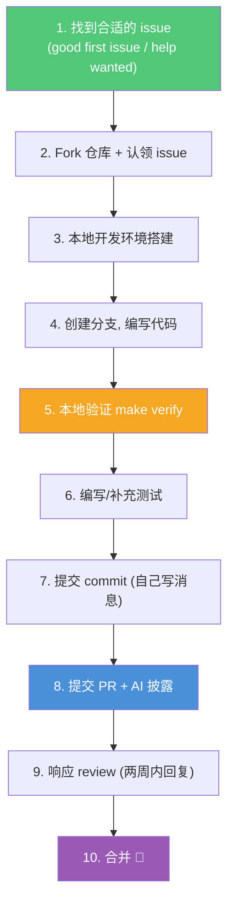
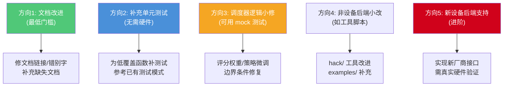
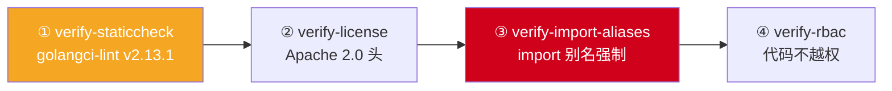
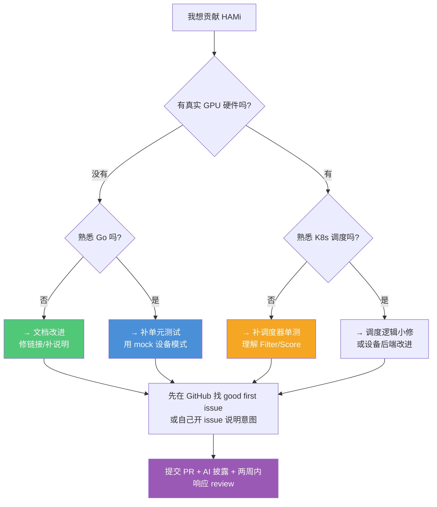

# 贡献代码入门指南（首次贡献开源项目）

本文档专门为**第一次想给开源项目贡献代码**的人编写，结合 HAMi 项目的实际情况，从"找什么做"到"怎么提交 PR"全流程指导。

## 一、贡献流程总览



---

## 二、HAMi 项目的贡献规则（必读）

在动手前，**务必先读 `CONTRIBUTING.md`**。HAMi 的贡献规则有几个特殊点，尤其是对 AI 辅助的严格规定。

### 2.1 AI 辅助披露规则（重点！）

HAMi 对 AI 辅助贡献有**极其严格**的规定，这是区别于多数开源项目的地方：

| 规则 | 要求 |
|------|------|
| **必须披露** | PR 描述中必须披露 AI 使用情况，包括范围（仅文档 / 代码生成 / review 回复）。示例：`"This PR was written primarily by Claude Code."` |
| **作者理解门槛** | 如果维护者问"这段代码如何工作"而作者答不上来，PR 会被关闭 |
| **硬件验证** | 影响设备分配或容器内隔离的改动，必须在**真实 GPU 硬件**上验证并记录设备型号和驱动版本。仅调度器扩展的改动可用 mock/单测 |
| **提交粒度** | AI 生成的大 PR 不被接受。非小修的 AI 辅助贡献必须先开 issue，拆分成可审查的 commit |
| **commit 消息** | **不接受 AI 生成的 commit 消息**，必须自己写 |
| **review 回复** | 必须自己写回复并针对具体问题。逐字/模板化的 AI 回复会导致 PR 被关闭 |
| **commit trailer** | **不要**把 AI 列为 co-author，不要用 `assisted-by`/`co-developed-by` 等 trailer，披露只放 PR 描述 |
| **review 评论** | 不要在 review 线程中发 AI 生成的评论 |

> **核心原则**：你可以用 AI 辅助，但必须理解代码、能解释代码、自己写消息和回复。

### 2.2 PR 提交前检查清单

- [ ] 运行 `make verify` 通过（license、lint、import 别名、RBAC）
- [ ] 如改了 Helm Chart，用 Helm v3.21.4 并运行 `make verify_chart`
- [ ] 所有 `.go` 文件有 Apache 2.0 license 头
- [ ] import 别名符合 `hack/.import-aliases`（如 `corev1`、`metav1`、`apierrors`）
- [ ] 影响设备分配/隔离的改动在真实硬件验证过
- [ ] commit 消息自己写，遵循 conventional commits（`fix:`/`feat:`/`docs:`/`refactor:`）
- [ ] 若用了 AI，PR 描述中已披露

### 2.3 生命周期规则

- **两周响应期**：维护者要求回复后，你必须在**两周内**回复，否则 issue/PR 会被关闭
- 关闭不是永久的，可以重新打开或重新提交

---

## 三、从哪里入手：适合首次贡献的方向

### 3.1 GitHub 上的 "good first issue" 和 "help wanted"

最直接的入口：

```bash
# 在 GitHub 上搜索
# https://github.com/Project-HAMi/HAMi/labels/good%20first%20issue
# https://github.com/Project-HAMi/HAMi/labels/help%20wanted
```

**认领方式**：在 issue 下回复表达意愿，维护者会分配给你。HAMi 的 `good-first.md` 模板提到可以用 `/assign` 认领。

### 3.2 具体适合首次贡献的 5 个方向



#### 方向 1：文档改进（最推荐的起点）

`CONTRIBUTING.md` 明确提到："Documentation improvements (fixing missing or broken links) are explicitly mentioned as a good way to contribute."

具体可做：
- 修复 `docs/develop/` 下文档的失效链接
- 补充缺失的文档（如某个特性缺少说明）
- 改善 README 的清晰度
- 添加代码注释（但要自己理解后写）

#### 方向 2：补充单元测试（推荐，无需硬件）

HAMi 的单测不需要真实 GPU（除 E2E 外）。你可以：
- 运行 `make test`，查看 `_output/coverage/coverage.out` 找低覆盖函数
- 参考已有的测试模式（`scheduler_test.go` 的 `registerMockDevice`、`nvidia/mig_topology_test.go` 的合成 profile）

**关键测试文件参考**：
| 参考文件 | 学到的模式 |
|---------|-----------|
| `pkg/scheduler/scheduler_test.go` | fake clientset + SharedInformerFactory + mock 设备 |
| `pkg/device/nvidia/mig_topology_test.go` | 合成 MIG profile 表，纯逻辑测试 |
| `pkg/device/nvidia/calculate_score_test.go` | P2P 拓扑评分测试 |
| `pkg/scheduler/score_test.go` | 评分矩阵测试（注释里有测试用例表） |

#### 方向 3：调度器逻辑小修

调度器扩展的改动**可用 mock/单测验证，不需要真实硬件**（这是 CONTRIBUTING.md 明确豁免的）：

- 修复 `pkg/scheduler/score.go` 评分边界条件
- 改进 `pkg/scheduler/policy/` 排序逻辑
- 修复 `pkg/util/nodelock/` 锁的边界情况
- NUMA refit 逻辑的小修复

#### 方向 4：工具与周边改进

- `hack/` 下的验证脚本改进
- `examples/` 补充示例
- `dashboards/` Grafana 面板改进
- `charts/hami/` Helm Chart 优化

#### 方向 5：新设备后端（进阶，不推荐首次）

如果你有特定硬件（如某厂商 GPU/NPU）的真实环境，可以为该厂商实现/完善设备后端。但这需要：
- 真实硬件验证
- 实现 13 个接口方法
- 理解现有后端的实现模式

---

## 四、本地开发环境搭建

### 4.1 前置条件

```bash
# Go >= 1.27
go version

# 验证脚本需要的工具会自动安装
# - golangci-lint v2.13.1 (SHA 固定)
# - addlicense v1.1.1
# - helm v3.8.1 (chart 验证)
```

### 4.2 克隆与构建

```bash
# 1. Fork 仓库后克隆你的 fork
git clone https://github.com/<你的用户名>/HAMi.git
cd HAMi

# 2. 添加上游 remote
git remote add upstream https://github.com/Project-HAMi/HAMi.git

# 3. 构建所有二进制
make build

# 4. 验证环境
make verify    # 这一步必须通过！
make test      # 跑单测
```

### 4.3 理解验证工具链

`make verify` 实际运行 `hack/verify-all.sh`，依次检查：



每个检查失败都会给出明确错误，逐一修复即可。

---

## 五、代码规范要点

### 5.1 Import 别名（最容易踩坑）

`hack/.import-aliases` 强制了 K8s API 的 import 别名，`hack/verify-import-aliases.sh` 会检查。常见的：

```go
// 正确 ✓
import (
    corev1 "k8s.io/api/core/v1"
    metav1 "k8s.io/apimachinery/pkg/apis/meta/v1"
    apierrors "k8s.io/apimachinery/pkg/api/errors"
)

// 错误 ✗ (会被验证脚本拒绝)
import (
    v1 "k8s.io/api/core/v1"
    "k8s.io/apimachinery/pkg/apis/meta/v1"
    "k8s.io/apimachinery/pkg/api/errors"
)
```

### 5.2 Import 分组顺序

goimports 配置了 local-prefixes `github.com/Project-HAMi/HAMi`，分组顺序：
1. 标准库
2. 外部库
3. `github.com/Project-HAMi/HAMi/...`（项目内部包）

### 5.3 License 头

所有 `.go` 文件必须有 Apache 2.0 license 头。可用 `addlicense` 自动添加：

```bash
addlicense -l apache -c 'The HAMi Authors' *.go
```

### 5.4 代码风格

`.golangci.yaml` 启用了较多 linter，注意：
- **禁止** `github.com/pkg/errors`（depguard 规则），用标准库 `errors` 或 `k8s.io/klog/v2`
- 圈复杂度 ≤ 20（gocyclo）
- 嵌套深度 ≤ 20（nestif）
- `pkg/device-plugin/` 排除在 lint 之外（fork 自 NVIDIA，历史代码）

---

## 六、提交 PR 的完整流程

### 6.1 分支与开发

```bash
# 1. 从 master 创建分支（用 conventional commit 前缀命名）
git checkout master
git pull upstream master
git checkout -b fix/some-scheduler-bug

# 2. 编写代码 + 测试
# ... 编辑代码 ...
go test ./pkg/scheduler/... -run TestYourTest -short --race -count=1

# 3. 本地验证
make verify
make test

# 4. 提交 (commit 消息自己写！)
git add -A
git commit -m "fix(scheduler): correct score calculation for edge case

Explain what was wrong and why this fixes it.

Fixes #123"
```

### 6.2 Commit 消息规范

HAMi 用 conventional commits，`labeler.yml` 会自动打标签：

| 前缀 | 自动标签 | 用途 |
|------|---------|------|
| `fix:` | `kind/bug` | bug 修复 |
| `feat:` | `kind/feature` | 新功能 |
| `docs:` | `kind/documentation` | 文档 |
| `refactor:` | `kind/enhancement` | 重构 |
| `chore:` | `kind/cleanup` | 杂项 |

### 6.3 提交 PR

```bash
# 推送到你的 fork
git push origin fix/some-scheduler-bug
```

然后在 GitHub 上创建 PR：

**PR 描述模板**（参考 `.github/PULL_REQUEST_TEMPLATE.md`）：
```markdown
**What this PR does / why we need it**:
（说明做了什么、为什么需要）

**Which issue(s) this PR fixes**:
Fixes #

**Special notes for your reviewer**:
（给 reviewer 的特别说明）

**AI Assistance Disclosure**:
This PR was written primarily by Claude Code. (如果有用 AI，必须披露)
# 或者：
No AI assistance was used in this PR.

**Release note**:
```release-note
（用户可见的变更说明，无则写 None）
```
```

### 6.4 PR 的 `/kind` 标签

PR 描述中包含 `/kind bug`、`/kind feature` 等来声明类型：
```
/kind bug
/kind cleanup
/kind documentation
/kind feature
```

---

## 七、首次贡献的实战建议

### 7.1 "第一次贡献"决策树



### 7.2 找 issue 的技巧

```bash
# 在 GitHub 上：
# 1. 看 good first issue: 
#    https://github.com/Project-HAMi/HAMi/issues?q=is:open+label:"good+first+issue"

# 2. 看 help wanted:
#    https://github.com/Project-HAMi/HAMi/issues?q=is:open+label:"help+wanted"

# 3. 看年度 roadmap issue（里面有待认领的 checklist）
#    在 issues 中搜索 "roadmap"

# 4. 自己发现问题：阅读代码时遇到不清楚的，可以开 issue 讨论
```

### 7.3 补测试的具体思路（最推荐的首次贡献）

```bash
# 1. 生成覆盖率报告
make test
go tool cover -func=_output/coverage/coverage.out | grep -v "100.0%"

# 2. 找到低覆盖的包，比如
# github.com/.../pkg/scheduler/numa_refit.go: 45.0%

# 3. 阅读该文件的现有测试
ls pkg/scheduler/*_test.go

# 4. 参考测试模式写新测试
# - 用 fake.NewSimpleClientset() 构造 K8s 客户端
# - 用 registerMockDevice 构造设备（不依赖真实硬件）
# - 用 table-driven test 组织用例

# 5. 验证
go test ./pkg/scheduler/... -run TestYourNewTest -short --race -count=1 -v
make verify
```

### 7.4 review 回复建议

- **及时**：维护者回复后，尽量在几天内响应（最迟两周）
- **针对具体问题**：逐条回复 review 意见，说清楚改了什么或为什么没改
- **自己写**：不要逐字粘贴 AI 的回复，理解后用自己的话回答
- **礼貌提问**：不理解 review 意见时，直接问，维护者通常乐于解释

### 7.5 常见坑（避坑指南）

| 坑 | 解决 |
|----|------|
| `make verify` 失败在 import 别名 | 对照 `hack/.import-aliases` 修改别名 |
| `make verify` 失败在 license 头 | 用 `addlicense` 工具自动补 |
| `make verify` 失败在 RBAC | 检查代码是否用了 Helm Chart 未授予的 K8s API 权限 |
| golangci-lint 报 `pkg/errors` 禁用 | 改用标准库 `errors` |
| golangci-lint 报圈复杂度 | 拆分函数，提取子函数 |
| CI 跑 E2E 失败 | E2E 需要真实 GPU；如果只改了调度器，确认改动不影响设备分配 |
| commit 被 labeler 打错标签 | 检查 commit 消息前缀是否符合 conventional commits |

---

## 八、没有 GPU 也能贡献：mock 设备与无硬件开发

### 官方规则的边界

HAMi 的 CONTRIBUTING.md 明确写道：

> 影响设备分配或容器内隔离的改动，必须在真实 GPU 硬件上验证；仅调度器扩展（scheduler extender）的改动可用 mock / 单元测试替代。

也就是说：**只要改动落在"调度器逻辑层"，没有 GPU 也能开发、能测试、能合并。** 这给没有硬件的首次贡献者划出了一条可行的路径。

### mock 设备的两种形态

#### 形态 1：单测里的 mock 设备（registerMockDevice）

`pkg/scheduler/scheduler_test.go:1344` 定义了一个实现完整 `Devices` 接口（13 个方法）的 mock 后端：

```go
type registerMockDevice struct {
    nodeDevices        []*device.DeviceInfo   // 假设备清单
    health             bool
    needUpdate         bool
    getNodeDevicesFunc func(node corev1.Node) ([]*device.DeviceInfo, error)
}

func (m *registerMockDevice) CommonWord() string { return "mock-vendor" }
func (m *registerMockDevice) Fit(...) (bool, map[string]device.ContainerDevices, string) {
    return false, nil, ""   // 可按测试需要改写返回值
}
// ... 其余 11 个接口方法同理
```

测试时把全局 `DevicesMap` 替换成 `{"mock-vendor": mockDev}`，调度器就把 mock 当成"一个厂商后端"来跑注册、健康检查、节点清理等逻辑，完全不碰 NVIDIA 代码。

#### 形态 2：真实 NVIDIA 后端 + fake 客户端

更关键的是 `Test_Filter`（`scheduler_test.go:509`）——它用的就是**真实 NVIDIA 配置**，但依然不需要 GPU：

```go
client.KubeClient = fake.NewClientset()        // 假 K8s 集群，不连真 apiserver
sConfig := &config.Config{ NvidiaConfig: nvidia.NvidiaConfig{...} }
config.InitDevicesWithConfig(sConfig)            // 真实 NVIDIA 后端
// 然后构造内存中的 Pod（声明 hami.io/gpu 等资源）+ Node 注解来跑 Filter
```

### 为什么不需要真实 GPU

关键在于 HAMi 的分层设计——`Fit()` 方法**只操作内存对象**，不碰硬件：

```
真实 GPU 硬件        ← 只有 Device Plugin 的 Allocate() / Monitor 的 NVML 采集 才碰
      ↑
      │ （这一层才需要真实硬件）
──────┼────────────────────────────────────────
DeviceUsage / DeviceInfo（内存对象）   ← Filter / Score / Bind 只操作这些
      │ （从节点注解 JSON 反序列化来，不读硬件）
──────┼────────────────────────────────────────
fake.NewClientset()   ← 假 apiserver，构造内存 Node / Pod
```

调度器的 `Fit()` 接收 `[]*DeviceUsage`，这些对象是 scheduler 从 `hami.io/node-nvidia-register` 注解里 JSON 反序列化出来的**纯内存结构体**。`Fit()` 只做算术比较（`Totalmem - Usedmem >= memreq`），不调用 NVML。所以只要在测试里构造好这些注解 / 对象，整套 Filter → Score → 选节点 → 写注解链路都能在纯 CPU 上跑通。

### 没有 GPU 的能做 / 不能做边界

| 没有 GPU **能做** | 没有 GPU **不能做** |
|---|---|
| 调度器 Filter / Score / Bind 逻辑修改 | Device Plugin 的 `Allocate()` 挂载 / MIG 创建（调 NVML） |
| 调度策略（binpack / spread / topology-aware） | vGPU Monitor 的 NVML 指标采集、优先级限流验证 |
| NUMA refit、节点锁、缓存逻辑 | `libvgpu.so` 的 CUDA 拦截 / 隔离逻辑 |
| 设备后端的**纯逻辑**部分（如 MIG 拓扑规划算法） | 容器内实际隔离效果验证 |
| 补充 / 编写单元测试（fake clientset + mock） | E2E 测试（需真实容器跑 CUDA） |
| 文档、Helm Chart、hack 工具脚本 | 任何影响"设备真实分配 / 隔离行为"的改动 |

> **特别好的切入点**：`pkg/device/nvidia/mig_topology_test.go`、`calculate_score_test.go` 已经证明——MIG 拓扑规划和 P2P 评分这类**纯算法逻辑**，用合成的 profile 表就能完整测试，零硬件依赖。这类代码可以放心写、放心提 PR。

### 纯逻辑测试不依赖 mock 也很多

HAMi 测试体系里，大量测试不依赖 mock 设备，而是直接构造内存对象：

```bash
# 这些测试全部不需要 GPU，在普通笔记本上就能跑
go test ./pkg/scheduler/... -run Test_Filter -short --race -count=1 -v
go test ./pkg/device/nvidia/... -run TestMigTopology -short --race -count=1 -v
go test ./pkg/scheduler/... -run Test_calcScore -short --race -count=1 -v
```

仓库里**测试代码 63,743 行 > 源码 29,815 行（2.1:1）**，其中绝大部分都是这类无硬件测试——这本身就说明了项目对"无 GPU 贡献"的友好程度。

### 给没有 GPU 的你的具体建议

1. **先跑通无硬件测试**：`make test` 在本地应能直接跑（少数需 NVML 的会 `-short` 跳过），确认环境 OK
2. **从一个纯逻辑测试入手**：在 `pkg/scheduler/scheduler_test.go` 里找个覆盖不足的函数，用 `Test_Filter` 的模式（fake clientset + 构造 Pod / Node）补测试
3. **PR 里如实说明**：在 PR 描述写"此改动仅涉及调度器扩展层，已通过单元测试验证，未在真实 GPU 硬件验证（按 CONTRIBUTING.md 豁免）"——维护者会认可

> 所以——**没有 GPU 完全可以开始贡献**，只要把范围框在调度器扩展层。这也是为什么本指南把"补充单元测试"列为最推荐的首次贡献方向。

---

## 九、从 issue 到合并的完整时间线预期

```mermaid
gantt
    title 典型首次贡献时间线
    dateFormat  X
    axisFormat %s
    section 准备
    找 issue / 认领       :a1, 0, 3d
    读代码 / 理解          :a2, after a1, 5d
    section 开发
    写代码 + 测试          :a3, after a2, 3d
    make verify 通过       :a4, after a3, 1d
    section 提交
    提交 PR               :a5, after a4, 1d
    section 审查
    等待首次 review        :a6, after a5, 5d
    响应 review + 修改     :a7, after a6, 3d
    合并                  :a8, after a7, 2d
```



> **说明**：这是乐观估计。实际可能因 review 轮数、改动范围而延长。保持耐心和积极沟通是关键。

---

## 十、社区与沟通

| 渠道 | 用途 |
|------|------|
| GitHub Issues | 报 bug、提 feature、讨论 |
| GitHub Discussions | 提问、讨论设计 |
| `MAINTAINERS.md` | 查看 5 位 committer + 2 位 community manager |
| `CODE_OF_CONDUCT.md` | 行为准则 |
| CNCF Slack（如有）| 社区即时沟通 |

> HAMi 是 CNCF 孵化项目，治理文档在单独的 `Project-HAMi/community` 仓库。

---

## 十一、给你的第一句话建议

1. **从小处着手**：第一次贡献不需要惊天动地，一个文档修复或一个测试补充就很好
2. **先沟通再编码**：对于非 trivial 的改动，先开 issue 或在 issue 下讨论方案，避免白干
3. **理解你写的每一行**：维护者会问"这段代码如何工作"，你要能解释
4. **善用现有模式**：写测试前先读现有的 `*_test.go`，写后端前先读 AMD 或 Biren 这种简单后端
5. **保持耐心**：review 是双向学习的过程，每轮 review 都让你更懂这个项目


祝你贡献顺利！🚀

---

## 十二、学习笔记与贡献代码的分支管理

学习笔记（本 `learning/` 目录）放哪都行，但**放在 fork 的 learning 分支里最方便**——笔记紧挨代码、fork 能备份。关键是守好分支隔离，避免笔记混进 PR。

### 会冲突吗？不会，只要守住一条规则

Git 的分支是独立的：只要贡献分支**从 master（同步过 upstream 的）切出**，永远不从 learning 分支切，learning 上的东西就**完全不参与** PR，零冲突。learning 分支上的 commit 不会影响从 master 新建的分支，它们就像两条平行线。

**唯一的真实风险**：如果学习笔记处于 untracked（未跟踪）状态，它不随分支切换消失——`git checkout master` 切到 master 后，`learning/` 目录仍躺在工作区。这时做贡献若手一抖 `git add -A`（加全部），就会把学习笔记一起加进 PR。

### 两道保险

#### 保险 1：把笔记 commit 到 learning 分支（从 untracked 变 tracked）

```bash
git checkout learning
git add learning/
git commit -m "docs: add personal learning notes"
git push origin learning
```

一旦 commit，这些文件就**绑定在 learning 分支**上了。之后切到 master，`learning/` 目录会从工作区消失（因为 master 分支里没有它），`git add -A` 自然扫不到它。**这是最关键的一步**——从 untracked 变成 learning 分支独有。

#### 保险 2：贡献代码时永远从 master 切分支，且用 `git add` 指定文件

```bash
# 1. 一次性配置 upstream（贡献要用）
git remote add upstream https://github.com/Project-HAMi/HAMi.git

# 2. 每次贡献前：同步 master
git checkout master
git fetch upstream
git rebase upstream/master   # 让 master 跟上官方最新
git push origin master       # 同步到你的 fork

# 3. 从（最新的）master 切贡献分支
git checkout -b fix/some-bug

# 4. 改代码后，用 git add 指定文件，别用 git add -A
git add pkg/scheduler/score.go
git commit -m "fix(scheduler): correct score edge case"
git push origin fix/some-bug
```

这样 `learning/` 永远不会混进 PR。

### 速查表

| 问题 | 答案 |
|---|---|
| 放单独文档还是 learning 分支？ | 放 fork 的 learning 分支，紧挨代码、fork 备份，最方便 |
| 会冲突吗？ | 不会，只要贡献分支从 master 切 |
| 笔记处于 untracked 怎么办？ | commit 到 learning 分支，从 untracked 变成该分支独有 |
| 唯一红线 | 贡献永远从 master 切分支，`git add` 指定文件别用 `-A` |

> 不要用 `.gitignore` 忽略 `/learning/` 来防误加——`.gitignore` 在 master 分支也会忽略它，会和"commit 到 learning 分支"冲突，带来混乱。前面的 commit + 指定文件 add 两道保险已经足够。

---

> **相关文档**：[05-学习路线.md](./05-学习路线.md) 先建立代码理解再动手贡献。
